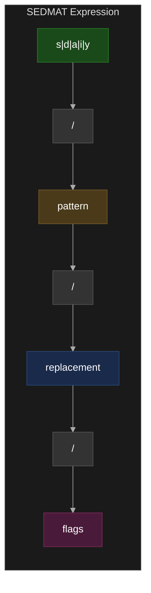
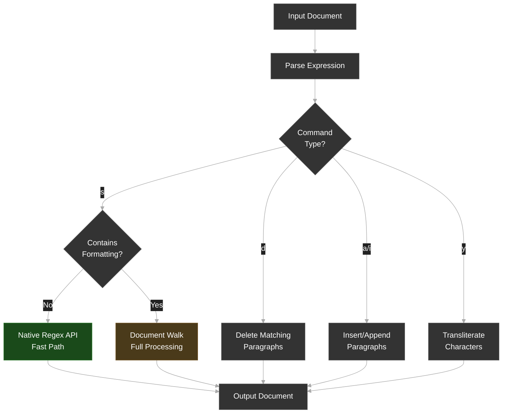

# SEDMAT: Sed-Expression-Driven Markdown Annotation & Transformation

**Version**: 3.0  
**Last Updated**: 2026-02-18  
**Status**: Draft

## Abstract

SEDMAT (Sed-Expression-Driven Markdown Annotation & Transformation) is a specification for document manipulation using sed-inspired syntax combined with a compact brace-based formatting DSL (`{flags}`). SEDMAT provides a portable, human-readable DSL for batch text transformations, formatting operations, and structural modifications targeting rich document formats (Google Docs, Word, etc.).

**Brace Syntax** is the canonical formatting system. Markdown-style formatting (`**bold**`, `*italic*`) is supported as a convenience layer for familiarity but is not the primary syntax.

## Introduction

SEDMAT enables:

- **Familiar Syntax**: sed-style `s/pattern/replacement/flags` expressions
- **Rich Formatting**: Brace syntax (`{b}`, `{c=red}`, `{h=1}`) as the canonical format
- **Markdown Shortcuts**: Optional convenience layer (`**bold**`, `*italic*`) for those familiar with Markdown
- **Structural Operations**: Headings, lists, tables, horizontal rules, blockquotes, code blocks
- **Extended sed Commands**: `d/` (delete), `a/` (append), `i/` (insert), `y/` (transliterate)
- **Regex Power**: Full Extended Regular Expression (ERE) support with back-references
- **Batch Processing**: Transform multiple elements via pipelines or `-f` batch files
- **Dry-Run Mode**: Preview changes before applying

## Conventions

The key words "MUST", "MUST NOT", "REQUIRED", "SHALL", "SHALL NOT", "SHOULD", "SHOULD NOT", "RECOMMENDED", "MAY", and "OPTIONAL" in this document are to be interpreted as described in [RFC 2119](https://datatracker.ietf.org/doc/html/rfc2119).

## Quick Start

### Minimal Expression

```bash
s/pattern/replacement/
```

**That's it!** A minimal SEDMAT expression:
- Searches for `pattern`
- Replaces with `replacement`
- Affects first match only

### With Brace Formatting

```bash
# Make the first occurrence of warning bold
s/warning/{b}/

# Bold and preserve matched text explicitly
s/warning/{b t=$0}/

# or shorter, because t defaults to $0
s/warning/{b t}/

# or even shorter, because t defaults to being present
s/warning/{b}/

# Bold + red
s/error/{b c=red}/

# Wrap in link
s/Google/{u=https://google.com}/

# Delete paragraphs containing "DRAFT"
d/DRAFT/

# Transliterate vowels
y/aeiou/AEIOU/
```

## Core Concepts

### Expression Anatomy



### Processing Model



SEDMAT processors SHOULD detect plain-text replacements and use native regex APIs for optimal performance.

---

## Commands

### Substitute: `s/pattern/replacement/[flags]` ✅ STABLE

The core command. Matches `pattern` in the document and replaces with `replacement`.

```bash
s/old/new/      # Replace first match
s/old/new/g     # Replace all matches
s/old/new/2     # Replace 2nd match only
```

### Delete: `d/pattern/` ✅ STABLE

Deletes entire paragraphs matching `pattern`.

```bash
d/DRAFT/        # Delete paragraphs containing "DRAFT"
d/^$/           # Delete empty paragraphs
d/TODO.*/       # Delete paragraphs matching regex
```

### Append: `a/pattern/text/` ✅ STABLE

Appends `text` as a new paragraph after each paragraph matching `pattern`.

```bash
a/Introduction/This text appears after the Introduction paragraph/
a/^Chapter/--- end of chapter ---/
```

### Insert: `i/pattern/text/` ✅ STABLE

Inserts `text` as a new paragraph before each paragraph matching `pattern`.

```bash
i/Conclusion/This text appears before the Conclusion paragraph/
i/^Chapter/=== start of chapter ===/
```

### Transliterate: `y/source/dest/` ✅ STABLE

Character-for-character transliteration, like sed's `y` command. Each character in `source` is replaced with the corresponding character in `dest`. Both strings MUST be the same length.

```bash
y/aeiou/AEIOU/          # Uppercase vowels
y/abc/xyz/              # a→x, b→y, c→z
y/ABCDEFGHIJKLMNOPQRSTUVWXYZ/abcdefghijklmnopqrstuvwxyz/  # Lowercase
```

---

## Flags and Delimiters

### Command Flags ✅ STABLE

Flag | Meaning | Status
--- | --- | ---
`g` | Replace ALL matches | ✅ STABLE
`2`..`9` | Replace Nth occurrence only | ✅ STABLE
`m` | Multiline mode (`^`/`$` match line boundaries) | ✅ STABLE
*(none)* | Replace first match only | ✅ STABLE

**Flag combinations**: The `n` (nth occurrence) flag is a digit appended after the delimiter. The `g` and `m` flags MAY be combined: `s/foo/bar/gm`.

```bash
s/foo/bar/g     # All occurrences
s/foo/bar/2     # 2nd occurrence only
s/^line/LINE/m  # Multiline: ^ matches start of each line
s/^line/LINE/gm # Multiline + global
```

**Conformance**: Implementations MUST support `g`, `n` (nth occurrence), and `m` (multiline) flags.

### Delimiters ✅ STABLE

The delimiter `/` MAY be replaced with any consistent character not appearing in the pattern or replacement:

```bash
# Standard
s/path/to/file/replacement/

# Alternate delimiter (when pattern contains /)
s#path/to/file#replacement#
s|path/to/file|replacement|
```

Implementations MUST support at minimum `/`, `#`, and `|` as delimiters.

---

## Brace Syntax — Canonical Formatting DSL ✅ STABLE

> **Status**: ✅ STABLE — Brace Syntax is the canonical formatting system in SEDMAT. All brace syntax features are REQUIRED for conformant implementations.

Brace Syntax is the **primary formatting system** in SEDMAT replacement strings. It uses `{key=value}` pairs and `{flag}` toggles inside curly braces to specify formatting, structural, and semantic attributes.

### Overview

Where Markdown uses wrapper characters (`**bold**`, `*italic*`), Brace Syntax uses flag-based declarations:

```bash
# Brace Syntax (canonical)
s/error/{b}/g

# Brace Syntax with color (no Markdown equivalent)
s/error/{b c=red}/g

# Markdown style (convenience alternative)
s/error/**error**/g
```

Brace Syntax is particularly useful for expressing attributes that have no Markdown equivalent (color, font, size, background, headings, breaks, comments, bookmarks, smart chips).

### Design Rules

1. **`t=` defaults to `$0`** — The implicit text flag preserves the matched text. Writing `{b}` is equivalent to `{b t=$0}`. The matched text is automatically preserved unless you explicitly override it with `t=something`.

2. **Boolean flags need no `=y`** — Simply `{b i _}` for bold + italic + underline.

3. **Bare value flags reset to defaults** — `{f s c z}` resets font to Arial, size to 11pt, color to black, background to clear.

4. **`{0}` resets ALL formatting** — Acts like CSS `all: unset`. MAY be combined: `{0 b}` resets everything then applies bold.

### The Implicit `t=` Default

This is the most important design rule. When you write a brace expression, the matched text (`$0`) is implicitly preserved:

```bash
# These are equivalent:
s/warning/{b}/g
s/warning/{b t=$0}/g

# The replacement is "warning" with bold applied
```

If you want to replace the text, use `t=`:

```bash
# Replace "error" with "ERROR" and make it bold
s/error/{b t=ERROR}/g

# Replace with back-reference
s/(\w+)/{b t=[$1]}/g   # "hello" → "[hello]" in bold
```

If you omit brace syntax entirely, you're doing a plain text replacement:

```bash
# Plain replacement (no formatting)
s/old/new/g
```

### Boolean Flags ✅ STABLE

Boolean flags are activated by presence alone. No `=y` is needed.

| Short | Long | Effect |
|-------|------|--------|
| `b` | `bold` | Bold |
| `i` | `italic` | Italic |
| `_` | `underline` | Underline |
| `-` | `strike` | Strikethrough |
| `#` | `code` | Monospace/code |
| `^` | `sup` | Superscript (entire replacement) |
| `,` | `sub` | Subscript (entire replacement) |
| `w` | `smallcaps` | Small caps |

**Examples:**

```bash
s/important/{b}/g              # Bold
s/emphasis/{i}/g               # Italic
s/code/{#}/g                   # Monospace
s/deleted/{-}/g                # Strikethrough
s/term/{_ i}/g                 # Underline + italic
```

### Negation ✅ STABLE

Use `!` prefix or `=n` suffix to explicitly turn off a flag:

```bash
s/already bold/{!b}/g     # Remove bold
s/already bold/{b=n}/g    # Equivalent
s/styled/{!b !i !_}/g     # Remove multiple styles
```

### Combining Boolean Flags ✅ STABLE

Multiple boolean flags MAY appear in a single brace group:

```bash
s/critical/{b i _}/g      # Bold + italic + underline
s/code/{# -}/g            # Monospace + strikethrough
s/warning/{b i c=red}/g   # Bold + italic + red color
```

### Value Flags ✅ STABLE

Value flags use `key=value` syntax. When a value flag appears **bare** (without `=value`), it resets to its default.

| Short | Long | Default (bare) | Effect |
|-------|------|----------------|--------|
| `t` | `text` | `$0` (matched text) | Replacement text |
| `c` | `color` | black | Text color |
| `z` | `bg` | clear | Background/highlight color |
| `f` | `font` | Arial | Font family |
| `s` | `size` | 11pt | Font size in points |
| `u` | `url` | (strip link) | Link/URL/URI |
| `h` | `heading` | NORMAL_TEXT | Heading level |
| `l` | `leading` | 1.15 | Line height |
| `a` | `align` | left | Text alignment |
| `o` | `opacity` | 100 | Opacity (percentage) |
| `n` | `indent` | 0 | Indent level |
| `k` | `kerning` | 0 | Letter spacing |
| `x` | `width` | — | Width in pixels |
| `y` | `height` | — | Height in pixels |
| `p` | `spacing` | — | Paragraph spacing above/below |
| `e` | `effect` | — | Shadow/glow/blur |

**Examples:**

```bash
# Colors
s/error/{c=red}/g
s/warning/{c=#FFA500}/g        # Orange (hex)
s/highlight/{z=yellow}/g       # Yellow background

# Fonts and sizes
s/heading/{f=Georgia s=18}/g
s/caption/{s=9 i}/g

# Combined
s/CRITICAL/{b c=red z=yellow s=14}/g
```

### Reset: `{0}` ✅ STABLE

The `{0}` flag resets ALL formatting to defaults, like CSS `all: unset`:

```bash
s/messy text/{0}/g            # Strip all formatting
s/messy text/{0 b}/g          # Reset then apply bold only
s/weird font/{0 f=Arial}/g    # Reset then set font
```

You can also reset individual attributes by using bare value flags:

```bash
s/text/{f s c z}/g            # Reset font, size, color, background
```

### Heading Shorthands ✅ STABLE

The `h` flag controls heading level using compact shorthands:

| Syntax | Maps to |
|--------|---------|
| `{h=t}` | TITLE |
| `{h=s}` | SUBTITLE |
| `{h=1}` | HEADING_1 |
| `{h=2}` | HEADING_2 |
| `{h=3}` | HEADING_3 |
| `{h=4}` | HEADING_4 |
| `{h=5}` | HEADING_5 |
| `{h=6}` | HEADING_6 |
| `{h}` (bare) | NORMAL_TEXT (reset heading) |

**Examples:**

```bash
s/My Document/{h=t}/g         # Set as Title
s/Overview/{h=s}/g            # Set as Subtitle
s/Chapter 1/{h=1 b}/g         # Heading 1 + bold
s/Section/{h=2}/g             # Heading 2
s/normal paragraph/{h}/g      # Reset to normal text
```

### Superscript and Subscript ✅ STABLE

SEDMAT provides three ways to handle super/subscript:

#### 1. Boolean Flags: `{^}` and `{,}`

Apply to the entire replacement:

```bash
s/TM/{^}/g                    # "TM" as superscript
s/2/{,}/g                     # "2" as subscript
```

#### 2. Inline Wrappers: `{super=text}` and `{sub=text}`

Apply to a portion of the replacement text:

```bash
s/E=mc2/E=mc{super=2}/g       # Only the "2" is superscript
s/H2O/H{sub=2}O/g             # Only the "2" is subscript
s/x squared/x{super=2}/g
s/CO2/CO{sub=2}/g
```

#### 3. Whole-Replacement: `{baseline=super}` and `{baseline=sub}`

Force the entire replacement to a specific baseline:

```bash
s/TM/{baseline=super}TM/g     # Explicit whole-replacement superscript
s/note/{baseline=sub}note/g   # Entire "note" as subscript
```

**Processing Order**: `{super=text}` and `{sub=text}` are processed first to extract inline portions, then boolean flags `{^}` and `{,}` apply to remaining text.

### Breaks: `{+}` ✅ STABLE

The `+` key inserts structural breaks. When used alone, it inserts a horizontal rule. With a value, it specifies the break type:

| Syntax | Effect |
|--------|--------|
| `{+}` | Horizontal rule (default) |
| `{+=p}` | Page break |
| `{+=c}` | Column break |
| `{+=s}` | Section break |

**Examples:**

```bash
s/---/{+}/g                   # Horizontal rule
s/END/{+=p}/g                 # Page break
s/COLUMN_BREAK/{+=c}/g        # Column break
s/SECTION_END/{+=s}/g         # Section break
```

### Comments: `{"=text}` ✅ STABLE

The `"` key attaches a comment (annotation) to the matched text:

```bash
s/TODO/{"=needs review}/g                 # Just a comment
s/TODO/{"=needs review b c=red}/g         # Comment + bold + red
s/FIXME/{"=assigned to viz b}/g           # Comment with formatting
```

### Bookmarks: `{@=name}` and `{u=#name}` ✅ STABLE

Create bookmark anchors and link to them:

| Syntax | Effect |
|--------|--------|
| `{@=name}` | Creates a bookmark anchor on the matched text |
| `{u=#name}` | Links to a bookmark by name |

**Examples:**

```bash
# Create a bookmark anchor
s/Chapter 1/{@=ch1 h=1}/g            # Bookmark + heading

# Link to the bookmark
s/see Chapter 1/{u=#ch1 c=blue _}/g  # Link to bookmark + styling

# Create anchor and style
s/Definition/{@=def1 b}/g

# Reference it elsewhere
s/as defined above/{u=#def1}/g
```

### URI Schemes for `{u=}` ✅ STABLE

The `u` flag accepts any valid URI. SEDMAT defines standard schemes and custom `chip://` schemes for Google Docs smart chips.

#### Standard Schemes

| Scheme | Example |
|--------|---------|
| `https://` | `{u=https://deft.md}` |
| `http://` | `{u=http://example.com}` |
| `mailto:` | `{u=mailto:viz@example.com}` |
| `tel:` | `{u=tel:+14076163470}` |
| `geo:` | `{u=geo:28.69,-81.31}` |
| `sms:` | `{u=sms:+14076163470}` |
| `webcal:` | `{u=webcal://feed.ics}` |
| `file:` | `{u=file:///path}` |

**Examples:**

```bash
s/Google/{u=https://google.com}/g
s/contact/{u=mailto:hello@example.com}/g
s/call us/{u=tel:+14075551234}/g
s/location/{u=geo:28.5383,-81.3792}/g
```

#### Custom `chip://` Schemes ✅ STABLE

For Google Docs smart chip insertion:

| Scheme | Example | Effect |
|--------|---------|--------|
| `chip://person/` | `{u=chip://person/viz@example.com}` | Person smart chip |
| `chip://date/` | `{u=chip://date/2026-03-15}` | Date smart chip |
| `chip://file/` | `{u=chip://file/DOC_ID}` | File link chip |
| `chip://place/` | `{u=chip://place/Orlando, FL}` | Place chip |
| `chip://dropdown/` | `{u=chip://dropdown/Draft\|Review\|Done}` | Dropdown chip |
| `chip://chart/` | `{u=chip://chart/SHEET_ID/0}` | Chart embed |
| `chip://bookmark/` | `{u=chip://bookmark/section-1}` | Internal doc link |

**Examples:**

```bash
s/viz/{u=chip://person/jtaylor@zendicate.com}/g
s/deadline/{u=chip://date/2026-03-15}/g
s/project doc/{u=chip://file/1BxiMVs0XRA5nFMdKvBdBZjgmUUqptlbs74OgvE2upms}/g
s/status/{u=chip://dropdown/Draft|Review|Done}/g
```

### Charts ✅ STABLE

Two approaches for embedding charts from Google Sheets:

#### 1. Direct chip:// Reference

```bash
s/CHART/{u=chip://chart/SHEET_ID/0 x=600 y=400}/g
```

Pulls chart at index `0` from the linked Sheet and embeds it at 600×400 pixels.

#### 2. Unix Pipe Composition

```bash
gog sheets chart SHEET_ID 0 --png | gog docs sed DOC_ID 's/PLACEHOLDER/!(-)/g'
```

Export chart as image, then insert via pipe.

### Brace Syntax Examples

```bash
# Simple styling
s/error/{b c=red}/g
s/TODO/{b c=red z=yellow}/g
s/note/{i c=gray s=10}/g

# Text replacement with formatting
s/old text/{b t=new text}/g
s/(\w+)/{i t=[$1]}/g

# Reset formatting
s/messy text/{0}/g
s/messy text/{0 b}/g          # Reset then bold

# Links and chips
s/viz/{u=chip://person/jtaylor@zendicate.com}/g
s/deadline/{u=chip://date/2026-03-15}/g
s/call me/{u=tel:+14075551234}/g
s/website/{u=https://example.com c=blue _}/g

# Headings
s/My Doc/{h=t}/g
s/Overview/{h=s}/g
s/Chapter 1/{h=1 b}/g

# Superscript and subscript
s/TM/{^}/g
s/E=mc2/E=mc{super=2}/g
s/H2O/H{sub=2}O/g

# Breaks
s/END/{+=p}/g
s/---/{+}/g
s/SECTION/{+=s}/g

# Comments and bookmarks
s/TODO/{@=todo1 "=needs review b c=red}/g
s/see above/{u=#todo1 c=blue _}/g

# Combined
s/WARNING/{b i c=red s=14 z=yellow}/g
s/https\S+/{u=$0 c=blue _}/g
```

---

## Back-References ✅ STABLE

SEDMAT supports capture groups using `(...)` with references via `$1`-`$9` or `\1`-`\9`:

```bash
# Capture and format
s/(important)/{b t=$1}/g

# Bold all-caps words (2+ chars)
s/([A-Z]{2,})/{b t=$1}/g

# Wrap names in links
s/(@\w+)/{u=https://twitter.com/$1 t=$1}/g
```

### Reference Syntax

| Reference | Alternative | Meaning |
|-----------|-------------|---------|
| `$0` | `&` | Entire match |
| `$1` | `\1` | First capture group |
| `$2` | `\2` | Second capture group |
| `$n` | `\n` | Nth capture group (1-9) |

### Whole-Match: `&`

The `&` represents the entire matched text (like sed). Use `\&` for a literal ampersand.

```bash
# Wrap every match in brace formatting
s/important/{b}/g             # Implicit: {b t=$0}

# Using & explicitly in plain replacement
s/important/(**&**)/g         # Markdown-style with parens

# Literal ampersand
s/rock/rock \& roll/          # \& = literal &
```

### Dollar Sign Escaping

Use `$$` for a literal dollar sign in replacements:

```bash
s/PRICE/$$49.99/g             # Outputs: $49.99
s/COST/$$100/g                # Outputs: $100
```

**Conformance**: Implementations MUST support `$1`-`$9`, `$0`, `&`, and `$$` notation. Support for `\1`-`\9` is RECOMMENDED for sed compatibility.

---

## Links ✅ STABLE

### Link Syntax

| Syntax | Effect | Status |
|--------|--------|--------|
| `[text](url)` | Hyperlink with text | REQUIRED |
| `<url>` | Auto-link (bare URL) | REQUIRED |
| `[text](url "title")` | Link with title attribute | RECOMMENDED |
| `{u=url}` | Brace syntax link | REQUIRED |

**Examples:**

```bash
# Markdown-style link
s/Google/[Google](https:\/\/google.com)/

# Brace syntax link (canonical)
s/Google/{u=https://google.com}/

# Link with styling
s/Google/{u=https://google.com c=blue _}/

# Link email addresses
s/(\S+@\S+)/[$1](mailto:$1)/g

# Auto-link bare URLs
s/(https:\/\/\S+)/<$1>/g
```

---

## Images ✅ STABLE

### Image Insertion

| Syntax | Effect | Status |
|--------|--------|--------|
| `` | Image, no alt text | REQUIRED |
| `!(url)` | Image, shorthand | REQUIRED |
| `` | Image with alt text | REQUIRED |
| `` | Image with caption | RECOMMENDED |
| `{width=N}` | Width in pixels | REQUIRED |
| `{height=N}` | Height in pixels | REQUIRED |
| `{w=N h=M}` | Both dimensions | REQUIRED |
| `{x=N y=M}` | Brace syntax dimensions | REQUIRED |

**Examples:**

```bash
# Insert at placeholder
s/{{LOGO}}//

# With alt text
s/{{LOGO}}//

# With dimensions
s/{{HERO}}/{width=600}/
s/{{BANNER}}/!(https:\/\/example.com\/banner.png){x=800 y=200}/
```

### Image References

Existing images MAY be referenced by position or alt text:

| Pattern | Meaning | Status |
|---------|---------|--------|
| `!(1)` | First image | REQUIRED |
| `!(2)` | Second image | REQUIRED |
| `!(-1)` | Last image | REQUIRED |
| `!(-2)` | Second to last | REQUIRED |
| `!(*)` | All images | REQUIRED |
| `![regex]` | Images matching alt text | REQUIRED |

**Examples:**

```bash
# Replace first image
s/!(1)/!(https:\/\/new-image.png)/

# Delete first image
s/!(1)//

# Replace by alt text
s/![old-logo]//
```

### Image Dimensions Grammar

```
dimensions     = "{" dimension-list "}"
dimension-list = dimension ( " " dimension )*
dimension      = width | height
width          = ("width" | "w" | "x") "=" number
height         = ("height" | "h" | "y") "=" number
number         = DIGIT+
```

---

## Tables ✅ STABLE

### Table References

| Pattern | Meaning | Status |
|---------|---------|--------|
| &#124;1&#124; | First table | REQUIRED |
| &#124;2&#124; | Second table | REQUIRED |
| &#124;-1&#124; | Last table | REQUIRED |
| &#124;*&#124; | All tables | REQUIRED |

### Table Creation

```bash
# Create 3×4 table (3 rows, 4 columns)
s/{{TABLE}}/|3x4|/

# With header flag
s/{{TABLE}}/|3x4:header|/

# Create table in empty document
s/^$/|3x4|/
```

**Limits**: Implementations SHOULD support 1–100 rows and 1–26 columns.

### Pipe Table Syntax

Markdown pipe table syntax is parsed into native tables:

```bash
s/PLACEHOLDER/| Name | Age | City |\n| Alice | 30 | NYC |\n| Bob | 25 | LA |/
```

The `|` delimited rows are parsed and converted to a native table. Header detection follows standard Markdown rules (separator row with `---`).

### Table Deletion

```bash
# Delete first table
s/|1|//

# Delete all tables
s/|*|//
```

### Cell References

| Pattern | Meaning | Status |
|---------|---------|--------|
| &#124;1&#124;[A1] | Cell A1 (Excel-style) | ✅ STABLE |
| &#124;1&#124;[1,1] | Row 1, Col 1 (1-indexed) | ✅ STABLE |
| &#124;1&#124;[1,*] | Entire row 1 (wildcard) | ✅ STABLE |
| &#124;1&#124;[*,2] | Entire column 2 (wildcard) | ✅ STABLE |
| &#124;1&#124;[*,*] | All cells | ✅ STABLE |
| &#124;1&#124;[A1:C3] | Range A1 to C3 | 🔮 PROPOSED |

**Examples:**

```bash
# Set cell content
s/|1|[A1]/Name/
s/|1|[B1]/Value/

# Bold entire header row
s/|1|[1,*]/{b}/

# Find/replace within specific cell
s/|1|[A1]:old/new/

# Find/replace across entire table
s/|1|[*,*]:TODO/DONE/g
```

### Row Operations

| Pattern | Meaning | Status |
|---------|---------|--------|
| &#124;1&#124;[row:2] | Delete row 2 | ✅ STABLE |
| &#124;1&#124;[row:-1] | Delete last row | ✅ STABLE |
| &#124;1&#124;[row:+2] | Insert row before row 2 | ✅ STABLE |
| &#124;1&#124;[row:$+] | Append row at end | ✅ STABLE |

### Column Operations

| Pattern | Meaning | Status |
|---------|---------|--------|
| &#124;1&#124;[col:2] | Delete column 2 | ✅ STABLE |
| &#124;1&#124;[col:-1] | Delete last column | ✅ STABLE |
| &#124;1&#124;[col:+2] | Insert column before column 2 | ✅ STABLE |
| &#124;1&#124;[col:$+] | Append column at end | ✅ STABLE |

### Table Merge

Merge a range of cells in a table:

```bash
s/|1|[r1,c1:r2,c2]/merge/
```

Merges cells from row `r1`, column `c1` to row `r2`, column `c2` (1-indexed).

```bash
# Merge A1:C1 (first 3 columns of row 1 as a header span)
s/|1|[1,1:1,3]/merge/

# Merge a 2x2 block
s/|1|[2,1:3,2]/merge/
```

### Unified Brace Addressing — 🔮 PROPOSED

> **Status**: PROPOSED — The `T=` key provides a unified brace-based addressing syntax for tabular data across Google Docs tables and Google Sheets. This is the future direction for table/sheet operations.

The `T=` key uses `!` as the mode switch: the `!` separator (following Excel/Sheets convention) enters sheet context. An optional `DOC_ID:` prefix enables cross-document references.

#### Syntax

```
{T=[doc:]sheet!cell}
{T=[doc:]sheet!range}
{T=[doc:]sheet!row-or-col-op}
```

| Component | Meaning | Examples |
|-----------|---------|----------|
| `doc:` | Document ID (optional, for cross-doc refs) | `1f1W9Wd...:`  |
| `sheet` | Sheet tab by name or 0-based index | `Sales`, `0`, `Budget` |
| `!` | Sheet/cell separator | |
| `cell` | Cell address (Excel-style) | `A1`, `B3` |
| `range` | Cell range | `A1:C3`, `A:A`, `2:2` |
| `*` | Wildcard (entire sheet) | `0!*` |
| `row=`/`col=` | Row/column operations | `row=$+`, `col=+3` |

#### Cell & Range Access

```bash
# Cell in first sheet
s/{T=0!A1}/{t=Revenue b}/

# Cell in named tab
s/{T=Budget!C5}/{t=$$1,234 b c=green}/

# Range
s/{T=Sales!A1:C3}/{b}/

# Entire column A
s/{T=0!A:A}/{c=blue}/

# Entire row 2
s/{T=0!2:2}/{b z=#eeeeee}/

# Entire sheet (all cells)
s/{T=0!*}/{0}/
```

#### Row & Column Operations

```bash
# Append row to first sheet
s/{T=0!row=$+}//

# Insert column before column 3
s/{T=0!col=+3}//

# Delete row 5
s/{T=Budget!row=5}//
```

#### Cross-Document References

```bash
# Reference cell in another doc's sheet
s/{T=1f1W9Wd...:Sales!A1}/{t=Updated}/

# Copy formatting across docs
s/{T=DOC_ID:0!A1:A10}/{b c=red}/
```

#### Merge

```bash
# Merge cells in a sheet
s/{T=0!A1:C1}/merge/

# Merge in named tab
s/{T=Summary!B2:D4}/merge/
```

#### Combined with Brace Formatting

```bash
# Set value + bold + color
s/{T=Sales!B2}/{t=$$42,000 b c=green}/

# Bold an entire header row
s/{T=0!1:1}/{b z=#333 c=white}/

# Format column as currency
s/{T=Budget!C:C}/{c=green b}/
```

> **Note**: Docs table syntax (`|1|[A1]`, `|1|[row:+2]`, etc.) remains supported as a stable shorthand for inline document tables. The `T=` brace syntax is the unified addressing model for both Docs tables and Sheets.

---

## Positional Insert ✅ STABLE

Special patterns for inserting content at document positions without matching existing text:

| Pattern | Meaning | Status |
|---------|---------|--------|
| `^$` | Empty document only | REQUIRED |
| `^` | Beginning of document (prepend) | REQUIRED |
| `$` | End of document (append) | REQUIRED |

### Behavior

- `^$` — Implementations MUST check that the document body is empty (no non-whitespace content). If the document is not empty, the expression MUST be a no-op.
- `^` — Implementations MUST insert the replacement at the beginning of the document body (index 1).
- `$` — Implementations MUST insert the replacement at the end of the document body.

### Examples

```bash
# Insert text into an empty document
s/^$/Hello world/

# Prepend title to any document
s/^/{h=t t=Document Title}\n/

# Append footer
s/$/\nGenerated on 2026-02-17/

# Insert table at start
s/^/|3x4|\n/
```

Positional insert MUST support all replacement features (formatting, images, tables, headings, lists, etc.).

---

## CLI Modes ✅ STABLE

### Dry-Run Mode

The `--dry-run` (or `-n`) flag shows what changes would be made without modifying the document:

```bash
gog docs sed --dry-run 's/foo/bar/g' <doc-id>
gog docs sed -n 's/old/new/' <doc-id>
```

Implementations MUST display the matches and proposed changes, and MUST NOT modify the document.

### Batch Processing

The `-f` flag reads expressions from a file (one per line). Lines starting with `#` are comments:

```bash
gog docs sed -f transforms.sed <doc-id>
```

**transforms.sed:**
```sed
# Header formatting
s/TITLE/{h=t}/
s/SUBTITLE/{h=s}/

# Clean up
s/DRAFT//g
d/TODO/

# Add footer
s/$/\nGenerated automatically/
```

---

## Processing Modes

### Native Mode (Fast Path)

When replacement contains **no formatting markers**, implementations SHOULD use native regex APIs:

```bash
s/colour/color/g          # Plain text
s/\bfoo\b/bar/g           # Word boundary
s/2023/2024/g             # Numeric
```

### Document Walk Mode

Required when formatting is present:

```bash
s/foo/{b}/g                            # Brace syntax
s/bar/{u=https://bar.com}/g            # Link
s/{{IMG}}/!(https://img.png)/          # Image
```

---

## Escaping ✅ STABLE

### Special Characters

Characters with special meaning MUST be escaped with backslash:

| Character | Escape | Context |
|-----------|--------|---------|
| `/` | `\/` | When used as delimiter |
| `*` | `\*` | Literal asterisk |
| `[` | `\[` | Literal bracket |
| `]` | `\]` | Literal bracket |
| `(` | `\(` | Literal paren (in replacement) |
| `)` | `\)` | Literal paren (in replacement) |
| `$` | `$$` | Literal dollar sign (in replacement) |
| `&` | `\&` | Literal ampersand (in replacement) |
| `\` | `\\` | Literal backslash |
| `{` | `\{` | Literal brace (in replacement) |
| `}` | `\}` | Literal brace (in replacement) |

---

## Markdown Formatting — Convenience Alternatives

> **Note**: This section describes Markdown shortcuts that serve as a convenience layer. The canonical formatting system is [Brace Syntax](#brace-syntax--canonical-formatting-dsl--stable). Implementations MUST support brace syntax; Markdown shortcuts are RECOMMENDED.

For users familiar with Markdown, SEDMAT supports common Markdown formatting syntax as an alternative to brace syntax. These produce identical output.

### Inline Styles

| Syntax | Brace Equivalent | Effect |
|--------|------------------|--------|
| `**text**` | `{b t=text}` | Bold |
| `*text*` | `{i t=text}` | Italic |
| `_text_` | `{i t=text}` | Italic |
| `***text***` | `{b i t=text}` | Bold + Italic |
| `~~text~~` | `{- t=text}` | Strikethrough |
| `` `text` `` | `{# t=text}` | Monospace |
| `__text__` | `{_ t=text}` | Underline |

**Examples:**

```bash
# These pairs are equivalent:
s/warning/**warning**/g       # Markdown
s/warning/{b}/g               # Brace (preferred)

s/emphasis/*emphasis*/g       # Markdown
s/emphasis/{i}/g              # Brace (preferred)

s/deprecated/~~deprecated~~/g # Markdown
s/deprecated/{-}/g            # Brace (preferred)
```

### Headings

| Syntax | Brace Equivalent | Effect |
|--------|------------------|--------|
| `# text` | `{h=1 t=text}` | Heading 1 |
| `## text` | `{h=2 t=text}` | Heading 2 |
| `### text` | `{h=3 t=text}` | Heading 3 |
| `#### text` | `{h=4 t=text}` | Heading 4 |
| `##### text` | `{h=5 t=text}` | Heading 5 |
| `###### text` | `{h=6 t=text}` | Heading 6 |

**Examples:**

```bash
# These pairs are equivalent:
s/TITLE/# My Document/        # Markdown
s/TITLE/{h=1 t=My Document}/  # Brace

s/Introduction/## Introduction/  # Markdown
s/Introduction/{h=2}/            # Brace (preserves text)
```

### Lists

| Syntax | Effect |
|--------|--------|
| `- item` | Bullet list item |
| `1. item` | Numbered list item |
| `  - nested` | Nested bullet (L1, 2 spaces) |
| `    - nested` | Nested bullet (L2, 4 spaces) |
| `  1. nested` | Nested numbered (L1, 2 spaces) |
| `    1. nested` | Nested numbered (L2, 4 spaces) |

**Examples:**

```bash
# Create a bullet list
s/ITEMS/- First item\n- Second item\n- Third item/

# Numbered list
s/STEPS/1. Step one\n2. Step two\n3. Step three/

# Nested lists
s/OUTLINE/- Top level\n  - Nested L1\n    - Nested L2/
```

### Horizontal Rules

Three or more of `-`, `*`, or `_` on a line create a horizontal rule:

```bash
s/DIVIDER/---/
s/BREAK/***/
s/SEPARATOR/___/
```

Brace equivalent: `{+}`

### Blockquotes

Lines prefixed with `>` create blockquotes (left-indented with grey left border):

```bash
s/QUOTE/> This is a blockquote/
s/EPIGRAPH/> To be or not to be\n> That is the question/
```

### Code Blocks

Triple backtick fences create code blocks (Courier New font, grey background). Language hints after the opening fence are stripped:

```bash
s/CODE/```\nfunction hello() {\n  console.log("hi");\n}\n```/
s/SNIPPET/```python\nprint("hello")\n```/
```

### Footnotes

The `[^text]` syntax creates native footnotes in the target document:

```bash
s/citation/[^See Smith et al., 2024]/
s/note/[^This is a footnote with detailed explanation]/
```

### Combining Markdown Formats

Formats MAY be nested according to Markdown precedence:

```bash
# Bold AND italic
s/warning/***warning***/

# Bold and underline
s/critical/**__critical__**/
```

**Processing Order:**


Implementations MUST process nesting from innermost to outermost.

---

## Grammar

### ABNF Notation

```abnf
sedmat-line    = sedmat-expr / comment
comment        = "#" *VCHAR

; --- Commands ---
sedmat-expr    = subst-expr / delete-expr / append-expr / insert-expr / xlat-expr

subst-expr     = "s" delimiter pattern delimiter replacement delimiter [flags]
delete-expr    = "d" delimiter pattern delimiter
append-expr    = "a" delimiter pattern delimiter text delimiter
insert-expr    = "i" delimiter pattern delimiter text delimiter
xlat-expr      = "y" delimiter source-chars delimiter dest-chars delimiter

delimiter      = "/" / "#" / "|" / %x21-2E / %x3A-40 / %x5B-60 / %x7B-7E
                 ; Any printable ASCII except alphanumeric

pattern        = regex-pattern
source-chars   = 1*CHAR
dest-chars     = 1*CHAR          ; Must be same length as source-chars

; --- Flags ---
flags          = *( "g" / DIGIT / "m" )

; --- Replacement ---
replacement    = *( plain-text / brace-expr / format-expr / back-ref / image-expr
                   / link-expr / table-expr / heading-expr / list-expr
                   / block-expr / footnote-expr )

; --- Brace Syntax (v3.0) ---
brace-expr     = "{" brace-body "}"
brace-body     = reset-all / brace-flags
reset-all      = "0" *( SP brace-flag )                  ; {0} or {0 b i}

brace-flags    = brace-flag *( SP brace-flag )
brace-flag     = bool-flag / neg-flag / value-flag / break-flag
                 / comment-flag / bookmark-flag / inline-wrapper

bool-flag      = "b" / "bold" / "i" / "italic" / "_" / "underline"
                 / "-" / "strike" / "#" / "code" / "^" / "sup"
                 / "," / "sub" / "w" / "smallcaps"

neg-flag       = "!" bool-flag / bool-flag "=n"          ; Negation

value-flag     = val-key "=" val-value
val-key        = "t" / "text" / "c" / "color" / "z" / "bg"
                 / "f" / "font" / "s" / "size" / "u" / "url"
                 / "l" / "leading" / "a" / "align" / "o" / "opacity"
                 / "n" / "indent" / "k" / "kerning" / "x" / "width"
                 / "y" / "height" / "p" / "spacing" / "h" / "heading"
                 / "e" / "effect"
val-value      = 1*(%x21-7E)                             ; Non-space printable ASCII

break-flag     = "+" ["=" break-type]
break-type     = "p" / "c" / "s"                         ; page / column / section

comment-flag   = DQUOTE "=" comment-text
comment-text   = 1*(%x20-7E)                             ; Printable ASCII incl. space

bookmark-flag  = "@" "=" bookmark-name
bookmark-name  = 1*(%x21-7E)

inline-wrapper = ("super" / "sub") "=" wrapper-text
wrapper-text   = 1*(%x21-7E)

heading-value  = "t" / "s" / "1" / "2" / "3" / "4" / "5" / "6"
                 ; t=TITLE, s=SUBTITLE, 1-6=HEADING_1-6

uri-value      = standard-uri / chip-uri / bookmark-uri
standard-uri   = scheme ":" *(%x21-7E)
scheme         = "https" / "http" / "mailto" / "tel" / "geo"
                 / "sms" / "webcal" / "file"
chip-uri       = "chip://" chip-type "/" *(%x21-7E)
chip-type      = "person" / "date" / "file" / "place"
                 / "dropdown" / "chart" / "bookmark"
bookmark-uri   = "#" bookmark-name                        ; {u=#name}

; --- Markdown Formatting (convenience layer) ---
format-expr    = bold / italic / bold-italic / strike / mono / underline

bold           = "**" content "**"
italic         = "*" content "*" / "_" content "_"
bold-italic    = "***" content "***"
strike         = "~~" content "~~"
mono           = "`" content "`"
underline      = "__" content "__"

footnote-expr  = "[^" content "]"

heading-expr   = 1*6("#") SP content    ; # through ######

list-expr      = bullet-item / numbered-item
bullet-item    = [indent] "- " content
numbered-item  = [indent] DIGIT+ ". " content
indent         = 2*SP                   ; 2 spaces per nesting level

block-expr     = horiz-rule / blockquote / code-block
horiz-rule     = "---" / "***" / "___"
blockquote     = "> " content
code-block     = "```" [lang-hint] LF content LF "```"

back-ref       = "$" DIGIT / "\" DIGIT / "&" / "$$"

link-expr      = "[" link-text "](" url [SP "\"" title "\""] ")"
               / "<" url ">"

image-expr     = image-insert / image-ref
image-insert   = "![" [alt-text] "](" url ")" [dimensions]
               / "!(" url ")" [dimensions]
image-ref      = "!(" index ")" / "![" regex "]"

dimensions     = "{" *( dim-spec SP ) "}"
dim-spec       = ("width" | "w" | "x") "=" NUMBER
               / ("height" | "h" | "y") "=" NUMBER

positional-pat = "^$" / "^" / "$"

; --- Tables ---
table-ref      = "|" index "|"
table-create   = "|" rows "x" cols [":header"] "|"
pipe-table     = pipe-row *(LF pipe-row)
pipe-row       = "|" cell *("|" cell) "|"

cell-ref       = table-ref "[" cell-spec "]"
cell-spec      = excel-ref / row-col / wildcard-ref / row-op / col-op / merge-range
excel-ref      = ALPHA+ DIGIT+
row-col        = (DIGIT+ / "*") "," (DIGIT+ / "*")
wildcard-ref   = "*" "," "*"
row-op         = "row:" ("+" DIGIT+ / "$+" / ["-"] DIGIT+)
col-op         = "col:" ("+" DIGIT+ / "$+" / ["-"] DIGIT+)
merge-range    = (DIGIT+ / ALPHA+DIGIT+) "," (DIGIT+ / ALPHA+DIGIT+) ":"
                 (DIGIT+ / ALPHA+DIGIT+) "," (DIGIT+ / ALPHA+DIGIT+)
```

---

## Conformance Levels

### Level 1: Core (REQUIRED)

- Basic `s/pattern/replacement/` and `s/pattern/replacement/g`
- Flags: `g`, `n` (nth occurrence), `m` (multiline)
- Brace syntax: boolean flags (`{b}`, `{i}`, `{_}`, `{-}`, `{#}`, `{^}`, `{,}`, `{w}`), negation (`{!b}`, `{b=n}`)
- Brace syntax: value flags (`{c=}`, `{z=}`, `{f=}`, `{s=}`, `{u=}`, `{t=}`, `{l=}`, `{a=}`, `{o=}`, `{n=}`, `{k=}`, `{x=}`, `{y=}`, `{p=}`, `{h=}`, `{e=}`)
- Brace syntax: reset (`{0}`)
- Brace syntax: implicit `t=$0` behavior
- Back-references: `$1`-`$9`, `$0`, `&`, `$$` escaping
- Links: `[text](url)`, `<url>`, `{u=url}`

### Level 2: Extended (REQUIRED)

- All Level 1 features
- Image insertion: ``, `!(url)`
- Image dimensions: `{width=N}`, `{height=N}`, `{x=N y=M}`
- Image references: `!(n)`, `!(-n)`, `!(*)`
- Alt-text matching: `![regex]`
- Brace syntax: heading shorthands (`{h=t}`, `{h=s}`, `{h=1}`–`{h=6}`)
- Brace syntax: superscript/subscript (`{^}`, `{,}`, `{super=text}`, `{sub=text}`, `{baseline=super|sub}`)

### Level 3: Structural (REQUIRED)

- All Level 2 features
- Positional insert: `^$`, `^`, `$`
- Table creation: `|RxC|`, `|RxC:header|`, pipe table syntax
- Table deletion: `|N|`, `|-N|`, `|*|`
- Cell references: `[A1]`, `[R,C]`, wildcards
- Row/column operations
- Table merge
- Brace syntax: breaks (`{+}`, `{+=p}`, `{+=c}`, `{+=s}`)
- Brace syntax: comments (`{"=text}`)
- Brace syntax: bookmarks (`{@=name}`, `{u=#name}`)

### Level 4: Commands & CLI (REQUIRED)

- All Level 3 features
- Delete command: `d/pattern/`
- Append command: `a/pattern/text/`
- Insert command: `i/pattern/text/`
- Transliterate command: `y/source/dest/`
- Dry-run mode: `--dry-run` / `-n`
- Batch processing: `-f file.sed`

### Level 5: Smart Chips & Charts (REQUIRED)

- All Level 4 features
- URI schemes: standard (`https:`, `mailto:`, `tel:`, `geo:`, `sms:`, `webcal:`, `file:`)
- URI schemes: `chip://` smart chips (person, date, file, place, dropdown, chart, bookmark)
- Charts: `chip://chart/` references

### Level 6: Markdown Convenience (RECOMMENDED)

- All Level 5 features
- Markdown shortcuts: `**bold**`, `*italic*`, `` `mono` ``, `~~strike~~`, `__underline__`
- Markdown headings: `#` through `######`
- Markdown lists: `- bullet`, `1. numbered`, nested
- Markdown blocks: `---` (horizontal rule), `> quote`, ``` code blocks ```
- Footnotes: `[^text]`

### Level 7: Advanced (OPTIONAL)

- All Level 6 features
- Range references (`[A1:C3]`)
- Cell styling
- @ mentions

---

## Implementation Status

| Feature | Status | Requirement Level |
|---------|--------|-------------------|
| Basic `s///` syntax | ✅ Stable | REQUIRED |
| Global flag `g` | ✅ Stable | REQUIRED |
| Nth occurrence flag `n` | ✅ Stable | REQUIRED |
| Multiline flag `m` | ✅ Stable | REQUIRED |
| Brace syntax: basic parsing | ✅ Stable | REQUIRED |
| Brace syntax: boolean flags (`b`, `i`, `_`, `-`, `#`, `^`, `,`, `w`) | ✅ Stable | REQUIRED |
| Brace syntax: negation (`!b`, `b=n`) | ✅ Stable | REQUIRED |
| Brace syntax: value flags (`c=`, `z=`, `f=`, `s=`, etc.) | ✅ Stable | REQUIRED |
| Brace syntax: text flag (`t=`) with implicit `$0` | ✅ Stable | REQUIRED |
| Brace syntax: reset (`{0}`) | ✅ Stable | REQUIRED |
| Brace syntax: heading shorthands (`h=t`, `h=1`, etc.) | ✅ Stable | REQUIRED |
| Brace syntax: breaks (`{+}`, `{+=p}`, etc.) | ✅ Stable | REQUIRED |
| Brace syntax: comments (`{"=text}`) | ✅ Stable | REQUIRED |
| Brace syntax: bookmarks (`{@=name}`) | ✅ Stable | REQUIRED |
| Brace syntax: URL/link (`u=`) | ✅ Stable | REQUIRED |
| Brace syntax: `chip://` smart chips | ✅ Stable | REQUIRED |
| Brace syntax: superscript/subscript (`{^}`, `{,}`, `{super=}`, `{sub=}`) | ✅ Stable | REQUIRED |
| Back-references `$1`-`$9`, `$0`, `&` | ✅ Stable | REQUIRED |
| Dollar sign escaping `$$` | ✅ Stable | REQUIRED |
| Links `[text](url)`, `{u=url}` | ✅ Stable | REQUIRED |
| Auto-links `<url>` | ✅ Stable | REQUIRED |
| Image insert ``, `!(url)` | ✅ Stable | REQUIRED |
| Image dimensions `{width=N}`, `{x=N y=M}` | ✅ Stable | REQUIRED |
| Image references `!(n)`, `![regex]` | ✅ Stable | REQUIRED |
| Native regex mode | ✅ Stable | RECOMMENDED |
| Positional insert (`^$`, `^`, `$`) | ✅ Stable | REQUIRED |
| Delete command `d/pattern/` | ✅ Stable | REQUIRED |
| Append command `a/pattern/text/` | ✅ Stable | REQUIRED |
| Insert command `i/pattern/text/` | ✅ Stable | REQUIRED |
| Transliterate command `y/src/dst/` | ✅ Stable | REQUIRED |
| Table creation (`\|RxC\|`) | ✅ Stable | REQUIRED |
| Pipe table syntax | ✅ Stable | REQUIRED |
| Table deletion (`\|N\|`, `\|*\|`) | ✅ Stable | REQUIRED |
| Cell references (`[A1]`, `[R,C]`) | ✅ Stable | REQUIRED |
| Cell wildcards (`[1,*]`, `[*,2]`, `[*,*]`) | ✅ Stable | REQUIRED |
| Row operations (insert/delete/append) | ✅ Stable | REQUIRED |
| Column operations (insert/delete/append) | ✅ Stable | REQUIRED |
| Table merge (`[r1,c1:r2,c2]/merge/`) | ✅ Stable | REQUIRED |
| Dry-run mode (`--dry-run`, `-n`) | ✅ Stable | REQUIRED |
| Batch processing (`-f file.sed`) | ✅ Stable | REQUIRED |
| Markdown formatting (`**`, `*`, `` ` ``, `~~`, `__`) | ✅ Stable | RECOMMENDED |
| Markdown headings (`#` through `######`) | ✅ Stable | RECOMMENDED |
| Markdown lists (`-`, `1.`, nested) | ✅ Stable | RECOMMENDED |
| Markdown blocks (rules, quotes, code) | ✅ Stable | RECOMMENDED |
| Footnotes `[^text]` | ✅ Stable | RECOMMENDED |
| Range references (`[A1:C3]`) | 🔮 Proposed | OPTIONAL |
| Table cell styling | 🔮 Proposed | OPTIONAL |
| @ mentions | 🔮 Proposed | OPTIONAL |

---

## Complete Examples

### Template Processing

```bash
# Replace placeholders with content
s/{{NAME}}/Acme Corp/
s/{{DATE}}/2026-02-17/
s/{{LOGO}}/{width=200}/
s/{{SIGNATURE}}/{u=mailto:john@acme.com t=John Doe}/
```

### Document Structure with Brace Syntax

```bash
# Build a structured document
s/^$/{h=t t=Quarterly Report}/
a/Quarterly Report/{h=2 t=Executive Summary}/
a/Executive Summary/The company performed well this quarter./
a/performed well/{h=2 t=Financial Results}/
a/Financial Results/| Metric | Q3 | Q4 |\n| Revenue | $$10M | $$12M |\n| Growth | 15% | 20% |/
s/$/\n{+}\n> Report generated automatically.\n[^Internal use only.]/
```

### Batch Cleanup

**cleanup.sed:**
```sed
# Header formatting
s/TITLE/{h=t}/
s/SUBTITLE/{h=s}/

# Clean up
s/DRAFT//g
d/TODO/

# Style important terms
s/([A-Z]{3,})/{b t=$1}/g

# Add header
s/^/{h=t t=Final Report}\n/
```

```bash
gog docs sed -f cleanup.sed <doc-id>
```

### Table Building

```bash
# Create and populate a pricing table
s/{{PRICING}}/|4x3|/
s/|1|[A1]/{b t=Plan}/
s/|1|[B1]/{b t=Monthly}/
s/|1|[C1]/{b t=Annual}/
s/|1|[1,*]/{b}/
s/|1|[A2]/Basic/
s/|1|[A3]/Pro/
s/|1|[A4]/Enterprise/

# Merge header cells
s/|1|[1,1:1,3]/merge/

# Add a row
s/|1|[row:$+]//
s/|1|[A5]/Custom/
```

### Smart Chip Integration

```bash
# Add person chips for team mentions
s/assigned to viz/{u=chip://person/viz@example.com t=@viz}/g
s/deadline/{u=chip://date/2026-03-15 t=March 15, 2026}/g

# Add project links
s/project doc/{u=chip://file/DOC_ID t=Project Documentation}/g

# Add status dropdown
s/STATUS/{u=chip://dropdown/Draft|Review|Done t=Draft}/g
```

---

## Error Handling

Implementations MUST handle errors gracefully:

| Error | Behavior |
|-------|----------|
| Invalid regex | MUST report error, MUST NOT modify document |
| Unmatched delimiter | MUST report error |
| Invalid brace syntax | SHOULD report warning, MAY attempt recovery |
| Invalid image reference | SHOULD report warning, MAY skip |
| Invalid table reference | SHOULD report warning, MAY skip |
| Mismatched `y///` lengths | MUST report error |
| Circular reference | MUST detect and reject |
| Invalid `chip://` scheme | SHOULD report warning, MAY skip |

---

## Security Considerations

1. **URL Validation**: Implementations SHOULD validate URLs in link and image expressions
2. **Injection Prevention**: Pattern and replacement MUST be treated as data, not executable code
3. **Resource Limits**: Implementations SHOULD limit regex complexity to prevent ReDoS attacks
4. **Sanitization**: Implementations operating on shared documents SHOULD sanitize output
5. **Smart Chip Validation**: Implementations SHOULD validate `chip://` URIs before insertion

---

## Future Considerations

> **Note**: The following features are under consideration for future versions but are not part of SEDMAT 3.0.

### Document-Level Directives

Page-level settings via `!^!{key=value}` syntax:

```bash
!^!{margin=1in size=letter orientation=portrait}
!^!{header=Company Name}
!^!{footer=Page {{page}} of {{pages}}}
```

This feature is deferred pending implementation experience.

---

## References

- [RFC 2119](https://datatracker.ietf.org/doc/html/rfc2119) - Key words for use in RFCs
- [CommonMark Spec](https://spec.commonmark.org/) - Markdown formatting reference
- [POSIX Extended Regular Expressions](https://pubs.opengroup.org/onlinepubs/9699919799/basedefs/V1_chap09.html)
- [sed(1) man page](https://www.gnu.org/software/sed/manual/sed.html) - GNU sed reference

---

## Appendix A: Quick Reference Card

```
┌──────────────────────────────────────────────────────────────────┐
│                    SEDMAT 3.0 Quick Reference                     │
├──────────────────────────────────────────────────────────────────┤
│ COMMANDS                                                          │
│   s/pattern/replacement/[flags]  Substitute                       │
│   d/pattern/                     Delete matching paragraphs       │
│   a/pattern/text/                Append after matching paragraphs │
│   i/pattern/text/                Insert before matching paragraphs│
│   y/source/dest/                 Transliterate characters         │
├──────────────────────────────────────────────────────────────────┤
│ FLAGS                                                             │
│   g          Global (all matches)    m     Multiline mode         │
│   2-9        Nth occurrence only     (none) First match only      │
├──────────────────────────────────────────────────────────────────┤
│ BRACE SYNTAX {flags} — CANONICAL FORMATTING             ✅ STABLE │
│                                                                   │
│ BOOLEAN FLAGS (presence activates):                               │
│   {b}         Bold          {i}         Italic                    │
│   {_}         Underline     {-}         Strikethrough             │
│   {#}         Code/mono     {^}         Superscript               │
│   {,}         Subscript     {w}         Small caps                │
│   {!b}        Negate bold   {b=n}       Negate (alt)              │
│   {b i _}     Combine flags                                       │
│                                                                   │
│ VALUE FLAGS (key=value):                                          │
│   {t=text}    Replacement text (default: $0 = matched text)       │
│   {c=red}     Color         {z=yellow}  Background                │
│   {f=Roboto}  Font          {s=14}      Size (pt)                 │
│   {u=URL}     Link          {u=#name}   Bookmark link             │
│   {h=1}       Heading 1     {h=t}       Title                     │
│   {h=s}       Subtitle      {h}         Normal text               │
│                                                                   │
│ IMPLICIT t= RULE:                                                 │
│   {b} expands to {b t=$0} — matched text is preserved             │
│                                                                   │
│ RESET:                                                            │
│   {0}         Reset ALL     {0 b}       Reset + bold              │
│                                                                   │
│ BREAKS:                                                           │
│   {+}         Horiz rule    {+=p}       Page break                │
│   {+=c}       Column break  {+=s}       Section break             │
│                                                                   │
│ SUPERSCRIPT/SUBSCRIPT:                                            │
│   {^}         Whole sup     {,}         Whole sub                 │
│   {super=2}   Inline sup    {sub=2}     Inline sub                │
│   {baseline=super}          {baseline=sub}                        │
│                                                                   │
│ COMMENTS & BOOKMARKS:                                             │
│   {"=text}    Comment       {@=name}    Bookmark anchor           │
│   {u=#name}   Link to bookmark                                    │
│                                                                   │
│ SMART CHIPS:                                                      │
│   {u=chip://person/email}   Person chip                           │
│   {u=chip://date/YYYY-MM-DD} Date chip                            │
│   {u=chip://file/ID}        File chip                             │
│   {u=chip://dropdown/a|b|c} Dropdown chip                         │
│   {u=chip://chart/ID/0}     Chart embed                           │
├──────────────────────────────────────────────────────────────────┤
│ MARKDOWN SHORTCUTS (convenience layer)                            │
│   **text**    Bold          *text*      Italic                    │
│   ~~text~~    Strike        `text`      Monospace                 │
│   __text__    Underline     ***text***  Bold+Italic               │
│   # text      Heading 1     ## text     Heading 2, etc.           │
│   - item      Bullet list   1. item     Numbered list             │
│   ---         Horiz rule    > text      Blockquote                │
│   ```code```  Code block    [^text]     Footnote                  │
├──────────────────────────────────────────────────────────────────┤
│ BACK-REFERENCES                                                   │
│   $0 or &     Entire match              $1-$9       Capture groups│
│   $$          Literal $                 \&          Literal &     │
├──────────────────────────────────────────────────────────────────┤
│ LINKS & IMAGES                                                    │
│   [text](url)               Hyperlink                             │
│   {u=url}                   Brace syntax link                     │
│                  Insert image                          │
│   !(url)                    Insert (shorthand)                    │
│   {width=N} or {x=N}        Set width                             │
│   !(1), !(-1), !(*)         Reference by position                 │
├──────────────────────────────────────────────────────────────────┤
│ POSITIONAL INSERT                                                 │
│   s/^$/text/                Insert into empty document            │
│   s/^/text/                 Prepend to document                   │
│   s/$/text/                 Append to document                    │
├──────────────────────────────────────────────────────────────────┤
│ TABLES                                                            │
│   |3x4|                     Create 3-row, 4-col table             │
│   | A | B |\n| 1 | 2 |      Pipe table syntax                     │
│   |1|, |-1|, |*|            Table reference / delete              │
│   |1|[A1]  |1|[1,2]         Cell reference                        │
│   |1|[1,*] |1|[*,2]         Row/column wildcard                   │
│   |1|[row:+2] |1|[row:$+]   Insert/append row                     │
│   |1|[col:+2] |1|[col:$+]   Insert/append column                  │
│   |1|[r1,c1:r2,c2]/merge/   Merge cell range                      │
├──────────────────────────────────────────────────────────────────┤
│ CLI OPTIONS                                                       │
│   --dry-run / -n            Preview changes (no modify)           │
│   -f file.sed               Batch expressions from file           │
└──────────────────────────────────────────────────────────────────┘
```

---

## Changelog

### v3.0 (2026-02-18)

**Major: Brace Syntax as Canonical Formatting System**

- **Brace Syntax promoted to canonical**: Brace syntax (`{b}`, `{c=red}`, `{h=1}`) is now the primary formatting system; Markdown shortcuts demoted to convenience layer
- **Structural reorganization**: Commands → Flags → Brace Syntax → Back-references → Links → Images → Tables → Positional Insert → CLI → Escaping → Markdown Alternatives → Grammar → Conformance → Status → Examples
- **Implicit `t=` rule**: Documented that `{b}` expands to `{b t=$0}` — matched text is preserved unless explicitly overridden
- **Boolean flags**: `b` (bold), `i` (italic), `_` (underline), `-` (strike), `#` (code), `^` (sup), `,` (sub), `w` (smallcaps)
- **Flag negation**: `!b` or `b=n` to explicitly turn off a style
- **Value flags**: `t=` (text), `c=` (color), `z=` (background), `f=` (font), `s=` (size), `u=` (url), `l=` (leading), `a=` (align), `o=` (opacity), `n=` (indent), `k=` (kerning), `x=` (width), `y=` (height), `p=` (spacing), `h=` (heading), `e=` (effect)
- **Heading shorthands**: `h=t` (title), `h=s` (subtitle), `h=1`–`h=6` (headings), `h` bare (reset)
- **Superscript/subscript**: `{^}` and `{,}` as boolean flags; `{super=text}` and `{sub=text}` as inline wrappers; `{baseline=super|sub}` for whole-replacement
- **Format reset**: `{0}` resets all formatting; bare value flags reset individual attributes
- **Breaks**: `{+}` (horizontal rule), `{+=p}` (page), `{+=c}` (column), `{+=s}` (section)
- **Comments**: `{"=text}` attaches annotations to matched text
- **Bookmarks**: `{@=name}` creates anchors; `{u=#name}` links to them
- **URI schemes**: Standard (`https:`, `mailto:`, `tel:`, `geo:`, `sms:`, `webcal:`, `file:`) and custom `chip://` schemes for Google Docs smart chips (person, date, file, place, dropdown, chart, bookmark)
- **Charts**: Direct `chip://chart/` reference and Unix pipe composition
- **Removed**: Colon-based `{key:value:text}` syntax — all brace syntax uses `key=value` format
- **Removed**: Separate "Style Attributes — PROPOSED" section — merged into Brace Syntax as STABLE
- **Removed**: `style-attrs` ABNF production — replaced with unified `brace-expr`
- **Deferred**: Document-level directives (`!^!{}`) moved to Future Considerations
- Updated ABNF grammar with unified brace syntax productions
- Updated conformance levels: Levels 1-5 are REQUIRED (Core through Smart Chips), Level 6 (Markdown) is RECOMMENDED, Level 7 (Advanced) is OPTIONAL
- Updated quick reference card with comprehensive brace syntax section

### v2.0 (2026-02-17)

- **New commands**: `d/pattern/` (delete), `a/pattern/text/` (append), `i/pattern/text/` (insert), `y/source/dest/` (transliterate)
- **New flags**: `n` (nth occurrence, e.g. `s/foo/bar/2`), `m` (multiline mode)
- **Heading styles**: `#` through `######` → native Heading 1–6
- **Paragraph styles**: `- bullet`, `1. numbered`, nested lists with indentation
- **Horizontal rules**: `---`, `***`, `___` → grey bottom border
- **Blockquotes**: `> text` → left-indented with grey left border
- **Code blocks**: Triple backtick fences → Courier New + grey background
- **Superscript/subscript**: `^{text}`, `~{text}`
- **Footnotes**: `[^text]` → native document footnotes
- **Pipe tables**: Markdown pipe syntax parsed into native tables
- **Table merge**: `s/|N|[r1,c1:r2,c2]/merge/` for cell merging
- **Dollar sign escaping**: `$$` → literal `$` in replacements
- **Whole-match backreference**: `&` for entire match, `\&` for literal ampersand
- **Dry-run mode**: `--dry-run` / `-n` flag for previewing changes
- **Batch processing**: `-f file.sed` for reading expressions from files
- Reference implementation: [gogcli](https://github.com/steipete/gogcli) `gog docs sed`

### v1.1 (2026-02-09)

- **Positional insert**: Added `^$`, `^`, `$` patterns for document-level insertion
- **Table creation**: Promoted to STABLE — `|RxC|` and `|RxC:header|` syntax
- **Table deletion**: Added `s/|N|//`, `s/|-N|//`, `s/|*|//`
- **Cell wildcards**: Added `[1,*]`, `[*,2]`, `[*,*]`
- **Row operations**: Added `[row:N]`, `[row:+N]`, `[row:$+]`
- **Column operations**: Added `[col:N]`, `[col:+N]`, `[col:$+]`
- Reference implementation: [gogcli](https://github.com/steipete/gogcli) `gog docs sed`

### v1.0 (2026-02-07)

- Initial specification
- Core syntax defined
- Text formatting standardized
- Image operations specified
- Table operations proposed
- Conformance levels established
