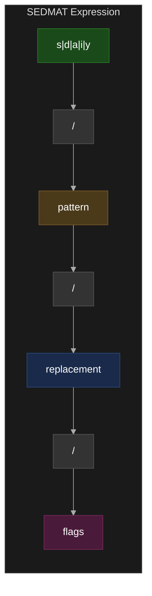
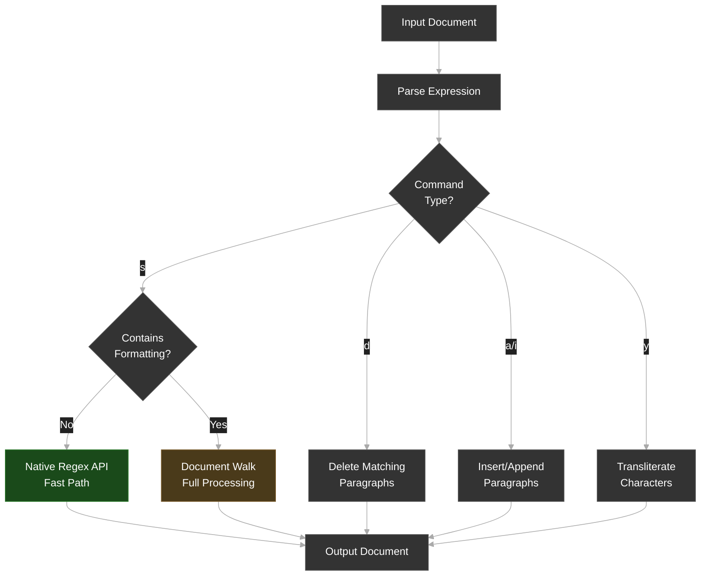

# SEDMAT: Sed-Expression-Driven Markdown Annotation & Transformation

**Version**: 2.0  
**Last Updated**: 2026-02-17  
**Status**: Draft

## Abstract

SEDMAT (Sed-Expression-Driven Markdown Annotation & Transformation) is a specification for document manipulation using sed-inspired syntax combined with Markdown-style formatting. It provides a portable, human-readable DSL for batch text transformations, formatting operations, and structural modifications targeting rich document formats (Google Docs, Word, etc.).

## Introduction

SEDMAT enables:

- **Familiar Syntax**: sed-style `s/pattern/replacement/flags` expressions
- **Rich Formatting**: Markdown-compatible styling (`**bold**`, `*italic*`, `[links](url)`)
- **Structural Operations**: Headings, lists, tables, horizontal rules, blockquotes, code blocks
- **Extended Commands**: `d/` (delete), `a/` (append), `i/` (insert), `y/` (transliterate)
- **Regex Power**: Full Extended Regular Expression (ERE) support with back-references
- **Batch Processing**: Transform multiple elements via pipelines or `-f` batch files
- **Dry-Run Mode**: Preview changes before applying

## Conventions

The key words "MUST", "MUST NOT", "REQUIRED", "SHALL", "SHALL NOT", "SHOULD", "SHOULD NOT", "RECOMMENDED", "MAY", and "OPTIONAL" in this document are to be interpreted as described in [RFC 2119](https://datatracker.ietf.org/doc/html/rfc2119).

## Quick Start

### Minimal Expression

```bash
s/pattern/replacement/
```

**That's it!** A minimal SEDMAT expression:
- Searches for `pattern`
- Replaces with `replacement`
- Affects first match only

### With Formatting

```bash
# Make "warning" bold
s/warning/**warning**/

# Wrap in link
s/Google/[Google](https://google.com)/

# Insert image at placeholder
s/{{LOGO}}//

# Delete paragraphs containing "DRAFT"
d/DRAFT/

# Transliterate vowels
y/aeiou/AEIOU/
```

## Core Concepts

### Expression Anatomy



### Processing Model



SEDMAT processors SHOULD detect plain-text replacements and use native regex APIs for optimal performance.

## Commands

### Substitute: `s/pattern/replacement/[flags]` ✅ STABLE

The core command. Matches `pattern` in the document and replaces with `replacement`.

```bash
s/old/new/      # Replace first match
s/old/new/g     # Replace all matches
s/old/new/2     # Replace 2nd match only
```

### Delete: `d/pattern/` ✅ STABLE

Deletes entire paragraphs matching `pattern`.

```bash
d/DRAFT/        # Delete paragraphs containing "DRAFT"
d/^$/           # Delete empty paragraphs
d/TODO.*/       # Delete paragraphs matching regex
```

### Append: `a/pattern/text/` ✅ STABLE

Appends `text` as a new paragraph after each paragraph matching `pattern`.

```bash
a/Introduction/This text appears after the Introduction paragraph/
a/^Chapter/--- end of chapter ---/
```

### Insert: `i/pattern/text/` ✅ STABLE

Inserts `text` as a new paragraph before each paragraph matching `pattern`.

```bash
i/Conclusion/This text appears before the Conclusion paragraph/
i/^Chapter/=== start of chapter ===/
```

### Transliterate: `y/source/dest/` ✅ STABLE

Character-for-character transliteration, like sed's `y` command. Each character in `source` is replaced with the corresponding character in `dest`. Both strings MUST be the same length.

```bash
y/aeiou/AEIOU/          # Uppercase vowels
y/abc/xyz/              # a→x, b→y, c→z
y/ABCDEFGHIJKLMNOPQRSTUVWXYZ/abcdefghijklmnopqrstuvwxyz/  # Lowercase
```

## Syntax Reference

### Flags

Flag | Meaning | Status
--- | --- | ---
`g` | Replace ALL matches | ✅ STABLE
`2`..`9` | Replace Nth occurrence only | ✅ STABLE
`m` | Multiline mode (`^`/`$` match line boundaries) | ✅ STABLE
*(none)* | Replace first match only | ✅ STABLE

**Flag combinations**: The `n` (nth occurrence) flag is a digit appended after the delimiter. The `g` and `m` flags MAY be combined: `s/foo/bar/gm`.

```bash
s/foo/bar/g     # All occurrences
s/foo/bar/2     # 2nd occurrence only
s/^line/LINE/m  # Multiline: ^ matches start of each line
s/^line/LINE/gm # Multiline + global
```

**Conformance**: Implementations MUST support `g`. Implementations MUST support `n` (nth occurrence) and `m` (multiline) flags.

### Delimiters

The delimiter `/` MAY be replaced with any consistent character not appearing in the pattern or replacement:

```bash
# Standard
s/path/to/file/replacement/

# Alternate delimiter (when pattern contains /)
s#path/to/file#replacement#
s|path/to/file|replacement|
```

Implementations MUST support at minimum `/`, `#`, and `|` as delimiters.

## Text Formatting

### Inline Styles

Syntax | Effect | Status
--- | --- | ---
`**text**` | Bold | REQUIRED
`*text*` | Italic | REQUIRED
`_text_` | Italic | REQUIRED
`***text***` | Bold + Italic | REQUIRED
`~~text~~` | Strikethrough | REQUIRED
`` `text` `` | Monospace | REQUIRED
`__text__` | Underline | RECOMMENDED
`{super:text}` | Superscript | REQUIRED
`{sub:text}` | Subscript | REQUIRED
`^{text}` | Superscript (DEPRECATED) | REQUIRED
`~{text}` | Subscript (DEPRECATED) | REQUIRED

**Examples:**

```bash
# Bold a keyword
s/CRITICAL/**CRITICAL**/g

# Italicize quoted text
s/"([^"]+)"/*$1*/g

# Strikethrough deprecated terms
s/deprecated/~~deprecated~~/g

# Code formatting for inline code
s/console\.log/`console.log`/g

# Superscript and subscript
s/H2O/H{sub:2}O/g
s/x2/x{super:2}/g
s/E=mc2/E=mc{super:2}/

# Deprecated syntax (still supported)
s/H2O/H{sub:2}O/g           # ~{} is deprecated, prefer {sub:}
s/E=mc2/E=mc{super:2}/        # ^{} is deprecated, prefer {super:}
```

### Combining Formats

Formats MAY be nested according to Markdown precedence:

```bash
# Bold AND italic
s/warning/***warning***/

# Bold and underline
s/critical/**__critical__**/

# All three
s/urgent/***__urgent__***/
```

**Processing Order:**


Implementations MUST process nesting from innermost to outermost.

### Heading Styles ✅ STABLE

Markdown heading syntax in replacements creates native document headings:

Syntax | Effect | Status
--- | --- | ---
`# text` | Heading 1 (Title) | ✅ STABLE
`## text` | Heading 2 (Subtitle) | ✅ STABLE
`### text` | Heading 3 | ✅ STABLE
`#### text` | Heading 4 | ✅ STABLE
`##### text` | Heading 5 | ✅ STABLE
`###### text` | Heading 6 | ✅ STABLE

```bash
# Convert placeholder to title
s/TITLE/# My Document/

# Make matched text a heading
s/Introduction/## Introduction/

# With formatting
s/WARNING/### **WARNING**/
```

### Paragraph Styles ✅ STABLE

Markdown list syntax in replacements creates native document lists:

Syntax | Effect | Status
--- | --- | ---
`- item` | Bullet list item | ✅ STABLE
`1. item` | Numbered list item | ✅ STABLE
`  - nested` | Nested bullet (L1, 2 spaces) | ✅ STABLE
`    - nested` | Nested bullet (L2, 4 spaces) | ✅ STABLE
`  1. nested` | Nested numbered (L1, 2 spaces) | ✅ STABLE
`    1. nested` | Nested numbered (L2, 4 spaces) | ✅ STABLE

```bash
# Create a bullet list
s/ITEMS/- First item\n- Second item\n- Third item/

# Numbered list
s/STEPS/1. Step one\n2. Step two\n3. Step three/

# Nested lists
s/OUTLINE/- Top level\n  - Nested L1\n    - Nested L2/
```

### Block Elements ✅ STABLE

#### Horizontal Rules

Three or more of `-`, `*`, or `_` on a line create a horizontal rule (rendered as a grey bottom border):

```bash
s/DIVIDER/---/
s/BREAK/***/
s/SEPARATOR/___/
```

#### Blockquotes

Lines prefixed with `>` create blockquotes (left-indented with grey left border):

```bash
s/QUOTE/> This is a blockquote/
s/EPIGRAPH/> To be or not to be\n> That is the question/
```

#### Code Blocks

Triple backtick fences create code blocks (Courier New font, grey background). Language hints after the opening fence are stripped:

```bash
s/CODE/```\nfunction hello() {\n  console.log("hi");\n}\n```/
s/SNIPPET/```python\nprint("hello")\n```/
```

### Inline Spans `{key:value:text}` ✅ STABLE

The general inline span pattern applies a style attribute to a portion of the replacement text:

```
{key:value:text}
```

This is the unified mechanism for inline styling. The `text` portion receives the style specified by `key:value`.

Syntax | Effect | Status
--- | --- | ---
`{super:text}` | Superscript | ✅ STABLE
`{sub:text}` | Subscript | ✅ STABLE
`{color:#RRGGBB:text}` | Colored text | 🔮 PROPOSED
`{font:name:text}` | Font family | 🔮 PROPOSED
`{size:N:text}` | Font size | 🔮 PROPOSED
`{bg:#RRGGBB:text}` | Background highlight | 🔮 PROPOSED

When used as a **whole-replacement attribute** (no `:text` suffix), the style applies to the entire replacement:

Syntax | Effect | Status
--- | --- | ---
`{baseline:super}` | Entire replacement as superscript | ✅ STABLE
`{baseline:sub}` | Entire replacement as subscript | ✅ STABLE

**Examples:**

```bash
# Inline superscript/subscript
s/E=mc2/E=mc{super:2}/
s/H2O/H{sub:2}O/
s/x squared/x{super:2}/

# Whole-replacement superscript
s/TM/{baseline:super}TM/

# Proposed: inline color
s/error/{color:#FF0000:error}/

# Proposed: inline font
s/code/{font:Courier:code}/
```

> **DEPRECATED**: The older `^{text}` (superscript) and `~{text}` (subscript) syntax is still supported for backward compatibility but `{super:text}` and `{sub:text}` are preferred.

### Footnotes ✅ STABLE

The `[^text]` syntax creates native footnotes in the target document:

```bash
s/citation/[^See Smith et al., 2024]/
s/note/[^This is a footnote with detailed explanation]/
```

### Back-References

SEDMAT MUST support capture groups using `(...)` with references via `$1`-`$9` or `\1`-`\9`:

```bash
# Capture and format
s/(important)/**$1**/g

# Bold all-caps words (2+ chars)
s/([A-Z]{2,})/**$1**/g

# Wrap names in links
s/(@\w+)/[$1](https://twitter.com/$1)/g
```

Reference | Alternative | Meaning
--- | --- | ---
`$0` | `&` | Entire match
`$1` | `\1` | First capture group
`$2` | `\2` | Second capture group
`$n` | `\n` | Nth capture group (1-9)

**Whole-match backreference**: `&` represents the entire matched text (like sed). Use `\&` for a literal ampersand.

```bash
# Wrap every match in bold
s/important/**&**/g       # & = the matched text

# Literal ampersand
s/rock/rock \& roll/      # \& = literal &
```

**Conformance**: Implementations MUST support `$1`-`$9` and `&` notation. Support for `\1`-`\9` is RECOMMENDED for sed compatibility.

### Dollar Sign Escaping ✅ STABLE

Use `$$` for a literal dollar sign in replacements. This prevents strings like `$49.99` from being parsed as backreferences.

```bash
s/PRICE/$$49.99/          # Outputs: $49.99
s/COST/$$100/g            # Outputs: $100
```

## Links

### Link Syntax

Syntax | Effect | Status
--- | --- | ---
`[text](url)` | Hyperlink with text | REQUIRED
`<url>` | Auto-link (bare URL) | REQUIRED
`[text](url "title")` | Link with title attribute | RECOMMENDED

**Examples:**

```bash
# Add hyperlink to text
s/Google/[Google](https:\/\/google.com)/

# Link email addresses
s/(\S+@\S+)/[$1](mailto:$1)/g

# Auto-link bare URLs
s/(https:\/\/\S+)/<$1>/g
```

## Images

### Image Insertion

Syntax | Effect | Status
--- | --- | ---
`` | Image, no alt text | REQUIRED
`!(url)` | Image, shorthand | REQUIRED
`` | Image with alt text | REQUIRED
`` | Image with caption | RECOMMENDED
`{width=N}` | Width in pixels | REQUIRED
`{height=N}` | Height in pixels | REQUIRED
`{w=N h=M}` | Both dimensions | REQUIRED

**Examples:**

```bash
# Insert at placeholder
s/{{LOGO}}//

# With alt text
s/{{LOGO}}//

# With dimensions
s/{{HERO}}/{width=600}/
```

### Image References

Existing images MAY be referenced by position or alt text:

Pattern | Meaning | Status
--- | --- | ---
`!(1)` | First image | REQUIRED
`!(2)` | Second image | REQUIRED
`!(-1)` | Last image | REQUIRED
`!(-2)` | Second to last | REQUIRED
`!(*)` | All images | REQUIRED
`![regex]` | Images matching alt text | REQUIRED

```bash
# Replace first image
s/!(1)/!(https:\/\/new-image.png)/

# Delete first image
s/!(1)//

# Replace by alt text
s/![old-logo]//
```

### Image Dimensions Grammar

```
dimensions     = "{" dimension-list "}"
dimension-list = dimension ( " " dimension )*
dimension      = width | height
width          = ("width" | "w") "=" number
height         = ("height" | "h") "=" number
number         = DIGIT+
```

## Positional Insert

**Status**: ✅ STABLE

Special patterns for inserting content at document positions without matching existing text:

Pattern | Meaning | Status
--- | --- | ---
`^$` | Empty document only | REQUIRED
`^` | Beginning of document (prepend) | REQUIRED
`$` | End of document (append) | REQUIRED

### Behavior

- `^$` — Implementations MUST check that the document body is empty (no non-whitespace content). If the document is not empty, the expression MUST be a no-op.
- `^` — Implementations MUST insert the replacement at the beginning of the document body (index 1).
- `$` — Implementations MUST insert the replacement at the end of the document body.

### Examples

```bash
# Insert text into an empty document
s/^$/Hello world/

# Prepend title to any document
s/^/# Document Title\n/

# Append footer
s/$/\nGenerated on 2026-02-17/
```

Positional insert MUST support all replacement features (formatting, images, tables, headings, lists, etc.).

---

## Tables

**Status**: ✅ STABLE

### Table References ✅

Pattern | Meaning | Status
--- | --- | ---
&#124;1&#124; | First table | REQUIRED
&#124;2&#124; | Second table | REQUIRED
&#124;-1&#124; | Last table | REQUIRED
&#124;*&#124; | All tables | REQUIRED

### Table Creation ✅

```bash
# Create 3×4 table (3 rows, 4 columns)
s/{{TABLE}}/|3x4|/

# With header flag
s/{{TABLE}}/|3x4:header|/

# Create table in empty document
s/^$/|3x4|/
```

**Limits**: Implementations SHOULD support 1–100 rows and 1–26 columns.

### Pipe Table Syntax ✅ STABLE

Markdown pipe table syntax is parsed into native tables:

```bash
s/PLACEHOLDER/| Name | Age | City |\n| Alice | 30 | NYC |\n| Bob | 25 | LA |/
```

The `|` delimited rows are parsed and converted to a native table. Header detection follows standard Markdown rules (separator row with `---`).

### Table Deletion ✅

```bash
# Delete first table
s/|1|//

# Delete all tables
s/|*|//
```

### Cell References ✅

Pattern | Meaning | Status
--- | --- | ---
&#124;1&#124;[A1] | Cell A1 (Excel-style) | ✅ STABLE
&#124;1&#124;[1,1] | Row 1, Col 1 (1-indexed) | ✅ STABLE
&#124;1&#124;[1,*] | Entire row 1 (wildcard) | ✅ STABLE
&#124;1&#124;[*,2] | Entire column 2 (wildcard) | ✅ STABLE
&#124;1&#124;[*,*] | All cells | ✅ STABLE
&#124;1&#124;[A1:C3] | Range A1 to C3 | 🔮 PROPOSED

**Examples:**

```bash
# Set cell content
s/|1|[A1]/Name/
s/|1|[B1]/Value/

# Bold entire header row
s/|1|[1,*]/**&**/

# Find/replace within specific cell
s/|1|[A1]:old/new/

# Find/replace across entire table
s/|1|[*,*]:TODO/DONE/g
```

### Row Operations ✅

Pattern | Meaning | Status
--- | --- | ---
&#124;1&#124;[row:2] | Delete row 2 | ✅ STABLE
&#124;1&#124;[row:-1] | Delete last row | ✅ STABLE
&#124;1&#124;[row:+2] | Insert row before row 2 | ✅ STABLE
&#124;1&#124;[row:$+] | Append row at end | ✅ STABLE

### Column Operations ✅

Pattern | Meaning | Status
--- | --- | ---
&#124;1&#124;[col:2] | Delete column 2 | ✅ STABLE
&#124;1&#124;[col:-1] | Delete last column | ✅ STABLE
&#124;1&#124;[col:+2] | Insert column before column 2 | ✅ STABLE
&#124;1&#124;[col:$+] | Append column at end | ✅ STABLE

### Table Merge ✅ STABLE

Merge a range of cells in a table:

```bash
s/|1|[r1,c1:r2,c2]/merge/
```

Merges cells from row `r1`, column `c1` to row `r2`, column `c2` (1-indexed).

```bash
# Merge A1:C1 (first 3 columns of row 1 as a header span)
s/|1|[1,1:1,3]/merge/

# Merge a 2x2 block
s/|1|[2,1:3,2]/merge/
```

### Cell Styling — 🔮 PROPOSED

```bash
# Background color
s/|1|[A1]/bg=#ff0000/

# Header row background
s/|1|[1,*]/bg=#eeeeee/

# Combined: set content + style
s/|1|[A1]/{bg=#ffff00}Important/
```

## People / Mentions

**Status**: PROPOSED

```bash
# Insert mention
s/TODO/@john@example.com/
```

## CLI Modes

### Dry-Run Mode ✅ STABLE

The `--dry-run` (or `-n`) flag shows what changes would be made without modifying the document:

```bash
gog docs sed --dry-run 's/foo/bar/g' <doc-id>
gog docs sed -n 's/old/new/' <doc-id>
```

Implementations MUST display the matches and proposed changes, and MUST NOT modify the document.

### Batch Processing ✅ STABLE

The `-f` flag reads expressions from a file (one per line). Lines starting with `#` are comments:

```bash
gog docs sed -f transforms.sed <doc-id>
```

**transforms.sed:**
```sed
# Header formatting
s/TITLE/# My Report/
s/SUBTITLE/## Q4 Results/

# Clean up
s/DRAFT//g
d/TODO/

# Add footer
s/$/\nGenerated automatically/
```

## Processing Modes

### Native Mode (Fast Path)

When replacement contains **no formatting markers**, implementations SHOULD use native regex APIs:

```bash
s/colour/color/g          # Plain text
s/\bfoo\b/bar/g           # Word boundary
s/2023/2024/g             # Numeric
```

### Document Walk Mode

Required when formatting is present:

```bash
s/foo/**foo**/g                        # Bold
s/bar/[bar](https:\/\/bar.com)/g       # Link
s/{{IMG}}/!(https:\/\/img.png)/        # Image
```

## Escaping

### Special Characters

Characters with special meaning MUST be escaped with backslash:

Character | Escape | Context
--- | --- | ---
`/` | `\/` | When used as delimiter
`*` | `\*` | Literal asterisk
`[` | `\[` | Literal bracket
`]` | `\]` | Literal bracket
`(` | `\(` | Literal paren (in replacement)
`)` | `\)` | Literal paren (in replacement)
`$` | `$$` | Literal dollar sign (in replacement)
`&` | `\&` | Literal ampersand (in replacement)
`\` | `\\` | Literal backslash

## Style Attributes — 🔮 PROPOSED

> **Status**: PROPOSED — not yet implemented.

Curly brace attributes on sed commands, following Pandoc/kramdown convention:

```bash
s/foo/bar/{font:Roboto size:14 color:#FF0000}
s/title/# Report/{font:Montserrat size:28 break:page}
```

### Supported Attributes (Proposed)

Attribute | Effect
--- | ---
`font:name` | Font family
`size:N` | Font size in points
`color:#RRGGBB` | Text color
`bg:#RRGGBB` | Background/highlight color
`break:page` | Insert page break after
`break:section` | Insert section break after

Attributes appear in `{}` after the closing delimiter and flags, space-separated.

## Document-Level Directives — 🔮 PROPOSED

> **Status**: PROPOSED — not yet implemented.

Standalone lines using `!^!{key:value ...}` for page-level settings:

```bash
!^!{margin:1in size:letter orientation:portrait}
!^!{header:Company Name header-font:Arial header-size:9}
!^!{footer:Page {{page}} of {{pages}} footer-align:center}
```

### Supported Directives (Proposed)

Key | Effect
--- | ---
`margin:SIZE` | Page margins (e.g., `1in`, `2.5cm`)
`size:FORMAT` | Page size (`letter`, `A4`, etc.)
`orientation:VALUE` | `portrait` or `landscape`
`header:TEXT` | Header text
`header-font:NAME` | Header font
`header-size:N` | Header font size
`header-align:VALUE` | Header alignment (`left`, `center`, `right`)
`footer:TEXT` | Footer text (supports `{{page}}`, `{{pages}}`)
`footer-font:NAME` | Footer font
`footer-size:N` | Footer font size
`footer-align:VALUE` | Footer alignment

## Grammar

### ABNF Notation

```abnf
sedmat-line    = sedmat-expr / directive

; --- Commands ---
sedmat-expr    = subst-expr / delete-expr / append-expr / insert-expr / xlat-expr

subst-expr     = "s" delimiter pattern delimiter replacement delimiter [flags]
delete-expr    = "d" delimiter pattern delimiter
append-expr    = "a" delimiter pattern delimiter text delimiter
insert-expr    = "i" delimiter pattern delimiter text delimiter
xlat-expr      = "y" delimiter source-chars delimiter dest-chars delimiter

delimiter      = "/" / "#" / "|" / %x21-2E / %x3A-40 / %x5B-60 / %x7B-7E
                 ; Any printable ASCII except alphanumeric

pattern        = regex-pattern
source-chars   = 1*CHAR
dest-chars     = 1*CHAR          ; Must be same length as source-chars

; --- Flags ---
flags          = *( "g" / DIGIT / "m" ) [style-attrs]

; --- Replacement ---
replacement    = *( plain-text / format-expr / back-ref / image-expr
                   / link-expr / table-expr / heading-expr / list-expr
                   / block-expr / footnote-expr / super-sub )

format-expr    = bold / italic / bold-italic / strike / mono / underline

bold           = "**" content "**"
italic         = "*" content "*" / "_" content "_"
bold-italic    = "***" content "***"
strike         = "~~" content "~~"
mono           = "`" content "`"
underline      = "__" content "__"

super-sub      = inline-span / superscript-dep / subscript-dep
inline-span    = "{" span-key ":" span-value [":" content] "}"
span-key       = "super" / "sub" / "baseline" / "color" / "font" / "size" / "bg"
span-value     = content
superscript-dep = "^{" content "}"    ; DEPRECATED — use {super:text}
subscript-dep  = "~{" content "}"     ; DEPRECATED — use {sub:text}

footnote-expr  = "[^" content "]"

heading-expr   = 1*6("#") SP content    ; # through ######

list-expr      = bullet-item / numbered-item
bullet-item    = [indent] "- " content
numbered-item  = [indent] DIGIT+ ". " content
indent         = 2*SP                   ; 2 spaces per nesting level

block-expr     = horiz-rule / blockquote / code-block
horiz-rule     = "---" / "***" / "___"
blockquote     = "> " content
code-block     = "```" [lang-hint] LF content LF "```"

back-ref       = "$" DIGIT / "\" DIGIT / "&" / "$$"

link-expr      = "[" link-text "](" url [SP "\"" title "\""] ")"
               / "<" url ">"

image-expr     = image-insert / image-ref
image-insert   = "![" [alt-text] "](" url ")" [dimensions]
               / "!(" url ")" [dimensions]
image-ref      = "!(" index ")" / "![" regex "]"

dimensions     = "{" *( dim-spec SP ) "}"
dim-spec       = ("width" / "w") "=" NUMBER
               / ("height" / "h") "=" NUMBER

positional-pat = "^$" / "^" / "$"

; --- Tables ---
table-ref      = "|" index "|"
table-create   = "|" rows "x" cols [":header"] "|"
pipe-table     = pipe-row *(LF pipe-row)
pipe-row       = "|" cell *("|" cell) "|"

cell-ref       = table-ref "[" cell-spec "]"
cell-spec      = excel-ref / row-col / wildcard-ref / row-op / col-op / merge-range
excel-ref      = ALPHA+ DIGIT+
row-col        = (DIGIT+ / "*") "," (DIGIT+ / "*")
wildcard-ref   = "*" "," "*"
row-op         = "row:" ("+" DIGIT+ / "$+" / ["-"] DIGIT+)
col-op         = "col:" ("+" DIGIT+ / "$+" / ["-"] DIGIT+)
merge-range    = (DIGIT+ / ALPHA+DIGIT+) "," (DIGIT+ / ALPHA+DIGIT+) ":"
                 (DIGIT+ / ALPHA+DIGIT+) "," (DIGIT+ / ALPHA+DIGIT+)

; --- Proposed: Style Attributes ---
style-attrs    = "{" attr-pair *( SP attr-pair ) "}"     ; 🔮 PROPOSED
attr-pair      = attr-key ":" attr-value

; --- Proposed: Document Directives ---
directive      = "!^!{" attr-pair *( SP attr-pair ) "}"  ; 🔮 PROPOSED
```

## Implementation Status

Feature | Status | Requirement Level
--- | --- | ---
Basic `s///` syntax | ✅ Stable | REQUIRED
Global flag `g` | ✅ Stable | REQUIRED
Nth occurrence flag `n` | ✅ Stable | REQUIRED
Multiline flag `m` | ✅ Stable | REQUIRED
Text formatting (bold, italic, strike, mono) | ✅ Stable | REQUIRED
Underline `__text__` | ✅ Stable | RECOMMENDED
Back-references `$1`-`$9`, `&` | ✅ Stable | REQUIRED
Dollar sign escaping `$$` | ✅ Stable | REQUIRED
Whole-match `&` / literal `\&` | ✅ Stable | REQUIRED
Links `[text](url)` | ✅ Stable | REQUIRED
Auto-links `<url>` | ✅ Stable | REQUIRED
Image insert ``, `!(url)` | ✅ Stable | REQUIRED
Image dimensions `{width=N}` | ✅ Stable | REQUIRED
Image references `!(n)`, `![regex]` | ✅ Stable | REQUIRED
Native regex mode | ✅ Stable | RECOMMENDED
Positional insert (`^$`, `^`, `$`) | ✅ Stable | REQUIRED
Headings (`#` through `######`) | ✅ Stable | REQUIRED
Bullet lists (`- item`) | ✅ Stable | REQUIRED
Numbered lists (`1. item`) | ✅ Stable | REQUIRED
Nested lists (indentation) | ✅ Stable | REQUIRED
Horizontal rules (`---`, `***`, `___`) | ✅ Stable | REQUIRED
Blockquotes (`> text`) | ✅ Stable | REQUIRED
Code blocks (triple backtick) | ✅ Stable | REQUIRED
Inline spans `{key:value:text}` | ✅ Stable | REQUIRED
Superscript `{super:text}` | ✅ Stable | REQUIRED
Subscript `{sub:text}` | ✅ Stable | REQUIRED
Whole-replacement `{baseline:super\|sub}` | ✅ Stable | REQUIRED
Legacy `^{text}`, `~{text}` (deprecated) | ✅ Stable | REQUIRED
Footnotes `[^text]` | ✅ Stable | REQUIRED
Delete command `d/pattern/` | ✅ Stable | REQUIRED
Append command `a/pattern/text/` | ✅ Stable | REQUIRED
Insert command `i/pattern/text/` | ✅ Stable | REQUIRED
Transliterate command `y/src/dst/` | ✅ Stable | REQUIRED
Table creation (`\|RxC\|`) | ✅ Stable | REQUIRED
Pipe table syntax | ✅ Stable | REQUIRED
Table deletion (`\|N\|`, `\|*\|`) | ✅ Stable | REQUIRED
Cell references (`[A1]`, `[R,C]`) | ✅ Stable | REQUIRED
Cell wildcards (`[1,*]`, `[*,2]`, `[*,*]`) | ✅ Stable | REQUIRED
Row operations (insert/delete/append) | ✅ Stable | REQUIRED
Column operations (insert/delete/append) | ✅ Stable | REQUIRED
Table merge (`[r1,c1:r2,c2]/merge/`) | ✅ Stable | REQUIRED
Dry-run mode (`--dry-run`, `-n`) | ✅ Stable | REQUIRED
Batch processing (`-f file.sed`) | ✅ Stable | REQUIRED
Range references (`[A1:C3]`) | 🔮 Proposed | OPTIONAL
Table cell styling | 🔮 Proposed | OPTIONAL
Style attributes `{key:value}` | 🔮 Proposed | OPTIONAL
Document directives `!^!{}` | 🔮 Proposed | OPTIONAL
@ mentions | 🔮 Proposed | OPTIONAL

## Complete Examples

### Template Processing

```bash
# Replace placeholders with content
s/{{NAME}}/Acme Corp/
s/{{DATE}}/2026-02-17/
s/{{LOGO}}/{width=200}/
s/{{SIGNATURE}}/[John Doe](mailto:john@acme.com)/
```

### Document Structure

```bash
# Build a structured document
s/^$/# Quarterly Report/
a/Quarterly Report/## Executive Summary/
a/Executive Summary/The company performed well this quarter./
a/performed well/## Financial Results/
a/Financial Results/| Metric | Q3 | Q4 |\n| Revenue | $$10M | $$12M |\n| Growth | 15% | 20% |/
s/$/\n---\n> Report generated automatically.\n[^Internal use only.]/
```

### Batch Cleanup

**cleanup.sed:**
```sed
# Remove drafts and TODOs
d/DRAFT/
d/TODO/

# Fix formatting
s/([A-Z]{3,})/**$1**/g
y/""/''/

# Add header
s/^/# Final Report\n/
```

```bash
gog docs sed -f cleanup.sed <doc-id>
```

### Table Building

```bash
# Create and populate a pricing table
s/{{PRICING}}/|4x3|/
s/|1|[A1]/**Plan**/
s/|1|[B1]/**Monthly**/
s/|1|[C1]/**Annual**/
s/|1|[1,*]/**&**/
s/|1|[A2]/Basic/
s/|1|[A3]/Pro/
s/|1|[A4]/Enterprise/

# Merge header cells
s/|1|[1,1:1,3]/merge/

# Add a row
s/|1|[row:$+]//
s/|1|[A5]/Custom/
```

## Error Handling

Implementations MUST handle errors gracefully:

Error | Behavior
--- | ---
Invalid regex | MUST report error, MUST NOT modify document
Unmatched delimiter | MUST report error
Invalid image reference | SHOULD report warning, MAY skip
Invalid table reference | SHOULD report warning, MAY skip
Mismatched `y///` lengths | MUST report error
Circular reference | MUST detect and reject

## Security Considerations

1. **URL Validation**: Implementations SHOULD validate URLs in link and image expressions
2. **Injection Prevention**: Pattern and replacement MUST be treated as data, not executable code
3. **Resource Limits**: Implementations SHOULD limit regex complexity to prevent ReDoS attacks
4. **Sanitization**: Implementations operating on shared documents SHOULD sanitize output

## Conformance Levels

### Level 1: Core (REQUIRED)

- Basic `s/pattern/replacement/` and `s/pattern/replacement/g`
- Flags: `g`, `n` (nth occurrence), `m` (multiline)
- Text formatting: `**bold**`, `*italic*`, `` `mono` ``, `~~strike~~`
- Back-references: `$1`-`$9`, `&`, `$$` escaping
- Links: `[text](url)`, `<url>`

### Level 2: Extended (REQUIRED)

- All Level 1 features
- Image insertion: ``, `!(url)`
- Image dimensions: `{width=N}`, `{height=N}`
- Image references: `!(n)`, `!(-n)`, `!(*)`
- Alt-text matching: `![regex]`
- Headings: `#` through `######`
- Lists: `- bullet`, `1. numbered`, nested

### Level 3: Structural (REQUIRED)

- All Level 2 features
- Positional insert: `^$`, `^`, `$`
- Table creation: `|RxC|`, `|RxC:header|`, pipe table syntax
- Table deletion: `|N|`, `|-N|`, `|*|`
- Cell references: `[A1]`, `[R,C]`, wildcards
- Row/column operations
- Table merge
- Block elements: horizontal rules, blockquotes, code blocks
- Inline elements: superscript, subscript, footnotes

### Level 4: Commands & CLI (REQUIRED)

- All Level 3 features
- Delete command: `d/pattern/`
- Append command: `a/pattern/text/`
- Insert command: `i/pattern/text/`
- Transliterate command: `y/source/dest/`
- Dry-run mode: `--dry-run` / `-n`
- Batch processing: `-f file.sed`

### Level 5: Advanced (OPTIONAL)

- All Level 4 features
- Style attributes `{key:value}`
- Document directives `!^!{}`
- Range references (`[A1:C3]`)
- Cell styling
- @ mentions

## References

- [RFC 2119](https://datatracker.ietf.org/doc/html/rfc2119) - Key words for use in RFCs
- [CommonMark Spec](https://spec.commonmark.org/) - Markdown formatting reference
- [POSIX Extended Regular Expressions](https://pubs.opengroup.org/onlinepubs/9699919799/basedefs/V1_chap09.html)
- [sed(1) man page](https://www.gnu.org/software/sed/manual/sed.html) - GNU sed reference

## Appendix A: Quick Reference Card

```
┌──────────────────────────────────────────────────────────────────┐
│                    SEDMAT 2.0 Quick Reference                     │
├──────────────────────────────────────────────────────────────────┤
│ COMMANDS                                                          │
│   s/pattern/replacement/[flags]  Substitute                       │
│   d/pattern/                     Delete matching paragraphs       │
│   a/pattern/text/                Append after matching paragraphs │
│   i/pattern/text/                Insert before matching paragraphs│
│   y/source/dest/                 Transliterate characters         │
├──────────────────────────────────────────────────────────────────┤
│ FLAGS                                                             │
│   g          Global (all matches)    m     Multiline mode         │
│   2-9        Nth occurrence only     (none) First match only      │
├──────────────────────────────────────────────────────────────────┤
│ FORMATTING                                                        │
│   **text**    Bold          *text*      Italic                    │
│   ~~text~~    Strike        `text`      Monospace                 │
│   __text__    Underline     ***text***  Bold+Italic               │
│   {super:t}   Superscript   {sub:t}     Subscript                 │
├──────────────────────────────────────────────────────────────────┤
│ HEADINGS & STRUCTURE                                              │
│   # text      Heading 1     ## text     Heading 2                 │
│   ### text    Heading 3     ####-###### Heading 4-6               │
│   - item      Bullet list   1. item     Numbered list             │
│     - nested  Nested (2sp)    1. nested Nested numbered           │
│   ---         Horiz rule    > text      Blockquote                │
│   ```code```  Code block    [^text]     Footnote                  │
├──────────────────────────────────────────────────────────────────┤
│ BACK-REFERENCES                                                   │
│   $1-$9       Capture groups    &       Entire match              │
│   $$          Literal $         \&      Literal &                 │
├──────────────────────────────────────────────────────────────────┤
│ LINKS & IMAGES                                                    │
│   [text](url)               Hyperlink                             │
│                  Insert image                         │
│   !(url)                    Insert (shorthand)                    │
│   {width=N}                 Set width                             │
│   !(1), !(-1), !(*)         Reference by position                 │
├──────────────────────────────────────────────────────────────────┤
│ POSITIONAL INSERT                                                 │
│   s/^$/text/                Insert into empty document            │
│   s/^/text/                 Prepend to document                   │
│   s/$/text/                 Append to document                    │
├──────────────────────────────────────────────────────────────────┤
│ TABLES                                                            │
│   |3x4|                     Create 3-row, 4-col table             │
│   | A | B |\n| 1 | 2 |     Pipe table syntax                     │
│   |1|, |-1|, |*|            Table reference / delete              │
│   |1|[A1]  |1|[1,2]        Cell reference                        │
│   |1|[1,*] |1|[*,2]        Row/column wildcard                   │
│   |1|[row:+2] |1|[row:$+]  Insert/append row                     │
│   |1|[col:+2] |1|[col:$+]  Insert/append column                  │
│   |1|[r1,c1:r2,c2]/merge/  Merge cell range                      │
├──────────────────────────────────────────────────────────────────┤
│ CLI OPTIONS                                                       │
│   --dry-run / -n            Preview changes (no modify)           │
│   -f file.sed               Batch expressions from file           │
└──────────────────────────────────────────────────────────────────┘
```

## Changelog

### v2.0 (2026-02-17)
- **New commands**: `d/pattern/` (delete), `a/pattern/text/` (append), `i/pattern/text/` (insert), `y/source/dest/` (transliterate)
- **New flags**: `n` (nth occurrence, e.g. `s/foo/bar/2`), `m` (multiline mode)
- **Heading styles**: `#` through `######` → native Heading 1–6
- **Paragraph styles**: `- bullet`, `1. numbered`, nested lists with indentation
- **Horizontal rules**: `---`, `***`, `___` → grey bottom border
- **Blockquotes**: `> text` → left-indented with grey left border
- **Code blocks**: Triple backtick fences → Courier New + grey background
- **Superscript/subscript**: `^{text}`, `~{text}`
- **Footnotes**: `[^text]` → native document footnotes
- **Pipe tables**: Markdown pipe syntax parsed into native tables
- **Table merge**: `s/|N|[r1,c1:r2,c2]/merge/` for cell merging
- **Dollar sign escaping**: `$$` → literal `$` in replacements
- **Whole-match backreference**: `&` for entire match, `\&` for literal ampersand
- **Dry-run mode**: `--dry-run` / `-n` flag for previewing changes
- **Batch processing**: `-f file.sed` for reading expressions from files
- **PROPOSED: Style attributes**: `{font:name size:N color:#RGB}` on expressions
- **PROPOSED: Document directives**: `!^!{margin:1in orientation:portrait}` for page settings
- Updated conformance levels: Level 4 (Commands & CLI) now REQUIRED
- Updated ABNF grammar with all new commands, flags, and syntax
- Reference implementation: [gogcli](https://github.com/steipete/gogcli) `gog docs sed`

### v1.1 (2026-02-09)
- **Positional insert**: Added `^$`, `^`, `$` patterns for document-level insertion
- **Table creation**: Promoted to STABLE — `|RxC|` and `|RxC:header|` syntax
- **Table deletion**: Added `s/|N|//`, `s/|-N|//`, `s/|*|//`
- **Cell wildcards**: Added `[1,*]`, `[*,2]`, `[*,*]`
- **Row operations**: Added `[row:N]`, `[row:+N]`, `[row:$+]`
- **Column operations**: Added `[col:N]`, `[col:+N]`, `[col:$+]`
- Updated conformance levels: Level 3 (Structural) now REQUIRED
- Reference implementation: [gogcli](https://github.com/steipete/gogcli) `gog docs sed`

### v1.0 (2026-02-07)
- Initial specification
- Core syntax defined
- Text formatting standardized
- Image operations specified
- Table operations proposed
- Conformance levels established
