# SEDMAT: Sed-Expression-Driven Markdown Annotation & Transformation

**Version**: 1.1  
**Last Updated**: 2026-02-09  
**Status**: Draft

## Abstract

SEDMAT (Sed-Expression-Driven Markdown Annotation & Transformation) is a specification for document manipulation using sed-inspired syntax combined with Markdown-style formatting. It provides a portable, human-readable DSL for batch text transformations, formatting operations, and structural modifications.

## Introduction

SEDMAT enables:

- **Familiar Syntax**: sed-style `s/pattern/replacement/flags` expressions
- **Rich Formatting**: Markdown-compatible styling (`**bold**`, `*italic*`, `[links](url)`)
- **Structural Operations**: Images, tables, and object references
- **Regex Power**: Full Extended Regular Expression (ERE) support with back-references
- **Batch Processing**: Transform multiple elements in a single expression

## Conventions

The key words "MUST", "MUST NOT", "REQUIRED", "SHALL", "SHALL NOT", "SHOULD", "SHOULD NOT", "RECOMMENDED", "MAY", and "OPTIONAL" in this document are to be interpreted as described in [RFC 2119](https://datatracker.ietf.org/doc/html/rfc2119).

## Quick Start

### Minimal Expression

```bash
s/pattern/replacement/
```

**That's it!** A minimal SEDMAT expression:
- Searches for `pattern`
- Replaces with `replacement`
- Affects first match only

### With Formatting

```bash
# Make "warning" bold
s/warning/**warning**/

# Wrap in link
s/Google/[Google](https://google.com)/

# Insert image at placeholder
s/{{LOGO}}//
```

## Core Concepts

### Expression Anatomy


### Processing Model


SEDMAT processors SHOULD detect plain-text replacements and use native regex APIs for optimal performance.

## Syntax Reference

### Flags

Flag | Keyword | Meaning
--- | --- | ---
`g` | Global | Replace ALL matches
*(none)* | - | Replace first match only

**Conformance**: Implementations MUST support both global and single-match modes.

### Delimiters

The delimiter `/` MAY be replaced with any consistent character not appearing in the pattern or replacement:

```bash
# Standard
s/path/to/file/replacement/

# Alternate delimiter (when pattern contains /)
s#path/to/file#replacement#
s|path/to/file|replacement|
```

Implementations MUST support at minimum `/`, `#`, and `|` as delimiters.

## Text Formatting

### Inline Styles

Syntax | Effect | Status
--- | --- | ---
`**text**` | Bold | REQUIRED
`*text*` | Italic | REQUIRED
`_text_` | Italic | REQUIRED
`***text***` | Bold + Italic | REQUIRED
`~~text~~` | Strikethrough | REQUIRED
`` `text` `` | Monospace | REQUIRED
`__text__` | Underline | RECOMMENDED

**Examples:**

```bash
# Bold a keyword
s/CRITICAL/**CRITICAL**/g

# Italicize quoted text
s/"([^"]+)"/*$1*/g

# Strikethrough deprecated terms
s/deprecated/~~deprecated~~/g

# Code formatting for inline code
s/console\.log/`console.log`/g
```

### Combining Formats

Formats MAY be nested according to Markdown precedence:

```bash
# Bold AND italic
s/warning/***warning***/

# Bold and underline
s/critical/**__critical__**/

# All three
s/urgent/***__urgent__***/
```

**Processing Order:**


Implementations MUST process nesting from innermost to outermost.

### Back-References

SEDMAT MUST support capture groups using `(...)` with references via `$1`-`$9` or `\1`-`\9`:

```bash
# Capture and format
s/(important)/**$1**/g

# Bold all-caps words (2+ chars)
s/([A-Z]{2,})/**$1**/g

# Wrap names in links
s/(@\w+)/[$1](https://twitter.com/$1)/g
```

Reference | Alternative | Meaning
--- | --- | ---
`$0` | `&` | Entire match
`$1` | `\1` | First capture group
`$2` | `\2` | Second capture group
`$n` | `\n` | Nth capture group (1-9)

**Conformance**: Implementations MUST support `$1`-`$9` notation. Support for `\1`-`\9` is RECOMMENDED for sed compatibility.

## Links

### Link Syntax

Syntax | Effect | Status
--- | --- | ---
`[text](url)` | Hyperlink with text | REQUIRED
`<url>` | Auto-link (bare URL) | REQUIRED
`[text](url "title")` | Link with title attribute | RECOMMENDED

**Examples:**

```bash
# Add hyperlink to text
s/Google/[Google](https:\/\/google.com)/

# Link email addresses
s/(\S+@\S+)/[$1](mailto:$1)/g

# Auto-link bare URLs
s/(https:\/\/\S+)/<$1>/g

# Link with title
s/RFC 2119/[RFC 2119](https:\/\/datatracker.ietf.org\/doc\/html\/rfc2119 "IETF RFC 2119")/
```

### Link Processing Flow


## Images

### Image Insertion

Syntax | Effect | Status
--- | --- | ---
`` | Image, no alt text | REQUIRED
`!(url)` | Image, shorthand | REQUIRED
`` | Image with alt text | REQUIRED
`` | Image with caption | RECOMMENDED
`{width=N}` | Width in pixels | REQUIRED
`{height=N}` | Height in pixels | REQUIRED
`{w=N h=M}` | Both dimensions | REQUIRED

**Examples:**

```bash
# Insert at placeholder
s/{{LOGO}}//

# With alt text
s/{{LOGO}}//

# With dimensions
s/{{HERO}}/{width=600}/

# With all attributes
s/{{BANNER}}/{w=800 h=200}/
```

### Image References

Existing images MAY be referenced by position or alt text:

Pattern | Meaning | Status
--- | --- | ---
`!(1)` | First image | REQUIRED
`!(2)` | Second image | REQUIRED
`!(-1)` | Last image | REQUIRED
`!(-2)` | Second to last | REQUIRED
`!(*)` | All images | REQUIRED
`![regex]` | Images matching alt text | REQUIRED

**Reference Resolution:**


**Examples:**

```bash
# Replace first image
s/!(1)/!(https:\/\/new-image.png)/

# Replace last image
s/!(-1)//

# Replace all images (global required)
s/!(*)/!(https:\/\/placeholder.png)/g

# Delete first image
s/!(1)//

# Delete all images
s/(*)//g

# Replace by alt text (exact)
s/![old-logo]//

# Replace by alt text (regex - starts with "fig-")
s/![fig-.*]/!(https:\/\/placeholder.png)/g

# Case-insensitive alt match
s/![(?i)logo]/!(https:\/\/new-logo.png)/
```

### Image Dimensions Grammar

```
dimensions     = "{" dimension-list "}"
dimension-list = dimension ( " " dimension )*
dimension      = width | height
width          = ("width" | "w") "=" number
height         = ("height" | "h") "=" number
number         = DIGIT+
```

## Positional Insert

**Status**: ✅ STABLE

Special patterns for inserting content at document positions without matching existing text:

Pattern | Meaning | Status
--- | --- | ---
`^$` | Empty document only | REQUIRED
`^` | Beginning of document (prepend) | REQUIRED
`$` | End of document (append) | REQUIRED

When used as the pattern in a SEDMAT expression, these bypass regex matching and instead insert the replacement at the specified position.

### Behavior

- `^$` — Implementations MUST check that the document body is empty (no non-whitespace content). If the document is not empty, the expression MUST be a no-op (0 replacements).
- `^` — Implementations MUST insert the replacement at the beginning of the document body (index 1).
- `$` — Implementations MUST insert the replacement at the end of the document body (before the trailing newline).

### Examples

```bash
# Insert text into an empty document
s/^$/Hello world/

# Prepend title to any document
s/^/Document Title\n/

# Append footer
s/$/\nGenerated on 2026-02-09/

# Create a table in an empty document
s/^$/|3x4|/

# Prepend with formatting
s/^/**Important Notice**\n/
```

### Interaction with Other Features

Positional insert MUST support all replacement features:
- Text formatting (`**bold**`, `*italic*`, etc.)
- Images (``, `!(url)`)
- Table creation (`|RxC|`)
- Escape sequences (`\n` for newlines)

---

## Tables

**Status**: ✅ STABLE (core operations); PROPOSED (styling, merge, ranges)

### Table References ✅

Pattern | Meaning | Status
--- | --- | ---
&#124;1&#124; | First table | REQUIRED
&#124;2&#124; | Second table | REQUIRED
&#124;-1&#124; | Last table | REQUIRED
&#124;*&#124; | All tables | REQUIRED

### Table Creation ✅

```bash
# Create 3×4 table (3 rows, 4 columns)
s/{{TABLE}}/|3x4|/

# With header flag
s/{{TABLE}}/|3x4:header|/

# Create table in empty document
s/^$/|3x4|/
```

**Limits**: Implementations SHOULD support 1–100 rows and 1–26 columns.

### Table Deletion ✅

```bash
# Delete first table
s/|1|//

# Delete last table
s/|-1|//

# Delete all tables
s/|*|//
```

When the pattern is a bare table reference (`|N|`, `|-N|`, or `|*|`) and the replacement is empty, implementations MUST delete the referenced table(s) from the document.

### Cell References ✅

```mermaid
graph TB
    subgraph "Cell Reference Syntax"
        A["[A1]<br/>Excel-style"] 
        B["[1,1]<br/>Row,Col (1-indexed)"]
        D["[A1:C3]<br/>Range 🔮"]
        E["[1,*]<br/>Entire row"]
        F["[*,2]<br/>Entire column"]
        G["[*,*]<br/>All cells"]
    end
```



Pattern | Meaning | Status
--- | --- | ---
&#124;1&#124;[A1] | Cell A1 (Excel-style) | ✅ STABLE
&#124;1&#124;[1,1] | Row 1, Col 1 (1-indexed) | ✅ STABLE
&#124;1&#124;[1,*] | Entire row 1 (wildcard) | ✅ STABLE
&#124;1&#124;[*,2] | Entire column 2 (wildcard) | ✅ STABLE
&#124;1&#124;[*,*] | All cells | ✅ STABLE
&#124;1&#124;[A1:C3] | Range A1 to C3 | 🔮 PROPOSED

**Wildcard Behavior**: When `*` is used for the row or column component, implementations MUST iterate over all matching cells in the table and apply the replacement to each.

**Examples:**

```bash
# Set cell content
s/|1|[A1]/Name/
s/|1|[B1]/Value/

# Bold existing cell content (& = matched content)
s/|1|[A1]/**&**/

# Bold entire header row (wildcard)
s/|1|[1,*]/**&**/

# Replace all cells in a column
s/|1|[*,3]/---/

# Find/replace within specific cell (sub-pattern after colon)
s/|1|[A1]:old/new/

# Find/replace across entire table
s/|1|[*,*]:TODO/DONE/g

# Find/replace within a column
s/|1|[*,1]:N\/A/-/g
```

### Row Operations ✅

Pattern | Meaning | Status
--- | --- | ---
&#124;1&#124;[row:2] | Delete row 2 | ✅ STABLE
&#124;1&#124;[row:-1] | Delete last row | ✅ STABLE
&#124;1&#124;[row:+2] | Insert row before row 2 | ✅ STABLE
&#124;1&#124;[row:$+] | Append row at end | ✅ STABLE

```bash
# Delete row 2
s/|1|[row:2]//

# Delete last row
s/|1|[row:-1]//

# Insert row before row 2
s/|1|[row:+2]//

# Append row at end
s/|1|[row:$+]//
```

**Semantics:**
- `[row:N]` with empty replacement → delete row N
- `[row:+N]` with empty replacement → insert empty row before row N
- `[row:$+]` → append empty row at end
- Negative indices count from the end (`-1` = last row)
- Implementations MUST NOT allow deleting the only row in a table

### Column Operations ✅

Pattern | Meaning | Status
--- | --- | ---
&#124;1&#124;[col:2] | Delete column 2 | ✅ STABLE
&#124;1&#124;[col:-1] | Delete last column | ✅ STABLE
&#124;1&#124;[col:+2] | Insert column before column 2 | ✅ STABLE
&#124;1&#124;[col:$+] | Append column at end | ✅ STABLE

```bash
# Delete column 2
s/|1|[col:2]//

# Delete last column
s/|1|[col:-1]//

# Insert column before column 2
s/|1|[col:+2]//

# Append column at end
s/|1|[col:$+]//
```

**Semantics:**
- Same conventions as row operations
- Implementations MUST NOT allow deleting the only column in a table

### Cell Styling — 🔮 PROPOSED

```bash
# Background color
s/|1|[A1]/bg=#ff0000/

# Header row background
s/|1|[1,*]/bg=#eeeeee/

# Alternating rows
s/|1|[odd,*]/bg=#f5f5f5/

# Combined: set content + style
s/|1|[A1]/{bg=#ffff00}Important/
```

## People / Mentions

**Status**: PROPOSED

Syntax | Effect
--- | ---
`@email` | @ mention person

```bash
# Insert mention
s/TODO/@john@example.com/

# Replace name with mention
s/John Smith/@john.smith@company.com/
```

## Processing Modes

### Native Mode (Fast Path)

When replacement contains **no formatting markers**, implementations SHOULD use native regex APIs:

```bash
# Native mode (no formatting):
s/colour/color/g          # Plain text
s/\bfoo\b/bar/g           # Word boundary
s/2023/2024/g             # Numeric
```

### Document Walk Mode

Required when formatting is present:

```bash
# Document walk mode (formatting needed):
s/foo/**foo**/g                        # Bold
s/bar/[bar](https:\/\/bar.com)/g       # Link
s/{{IMG}}/!(https:\/\/img.png)/        # Image
```

```mermaid
flowchart TB
    EXPR[Expression] --> ANALYZE{Analyze<br/>Replacement}
    ANALYZE -->|Plain text only| NATIVE["Native Regex<br/>(Fast)"]
    ANALYZE -->|Contains **,*,~~,etc| WALK["Document Walk<br/>(Full features)"]
    ANALYZE -->|Contains [](url)| WALK
    ANALYZE -->|Contains !()| WALK
    ANALYZE -->|Contains \|table\|| WALK
    
    NATIVE --> APPLY[Apply Changes]
    WALK --> APPLY
    
    style NATIVE fill:#90ee90
    style WALK fill:#fff4e1
```

## Escaping

### Special Characters

Characters with special meaning MUST be escaped with backslash:

Character | Escape | Context
--- | --- | ---
`/` | `\/` | When used as delimiter
`*` | `\*` | Literal asterisk
`[` | `\[` | Literal bracket
`]` | `\]` | Literal bracket
`(` | `\(` | Literal paren (in replacement)
`)` | `\)` | Literal paren (in replacement)
`$` | `\$` | Literal dollar sign
`\` | `\\` | Literal backslash

**Example:**

```bash
# Match literal asterisks
s/\*\*bold\*\*/**bold**/

# URL with slashes (use alternate delimiter)
s#http://old.com#https://new.com#g
```

## Grammar

### ABNF Notation

```abnf
sedmat-expr    = "s" delimiter pattern delimiter replacement delimiter [flags]

delimiter      = "/" / "#" / "|" / %x21-2E / %x3A-40 / %x5B-60 / %x7B-7E
                 ; Any printable ASCII except alphanumeric

pattern        = regex-pattern

replacement    = *( plain-text / format-expr / back-ref / image-expr / link-expr / table-expr )

flags          = *( "g" )

format-expr    = bold / italic / bold-italic / strike / mono / underline

bold           = "**" content "**"
italic         = "*" content "*" / "_" content "_"
bold-italic    = "***" content "***"
strike         = "~~" content "~~"
mono           = "`" content "`"
underline      = "__" content "__"

back-ref       = "$" DIGIT / "\" DIGIT / "&"

link-expr      = "[" link-text "](" url ["\"" title "\""] ")"
               / "<" url ">"

image-expr     = image-insert / image-ref
image-insert   = "![" [alt-text] "](" url ")" [dimensions]
               / "!(" url ")" [dimensions]
image-ref      = "!(" index ")" / "![" regex "]"

dimensions     = "{" *( dim-spec SP ) "}"
dim-spec       = ("width" / "w") "=" NUMBER
               / ("height" / "h") "=" NUMBER

positional-pat = "^$" / "^" / "$"      ; Positional insert patterns

table-ref      = "|" index "|"          ; Table reference (|1|, |-1|, |*|)
table-create   = "|" rows "x" cols [":header"] "|"

cell-ref       = table-ref "[" cell-spec "]"
cell-spec      = excel-ref / row-col / wildcard-ref / row-op / col-op
excel-ref      = ALPHA+ DIGIT+         ; A1, B2, AA10
row-col        = (DIGIT+ / "*") "," (DIGIT+ / "*")
wildcard-ref   = "*" "," "*"
row-op         = "row:" ("+" DIGIT+ / "$+" / ["-"] DIGIT+)
col-op         = "col:" ("+" DIGIT+ / "$+" / ["-"] DIGIT+)
```

## Implementation Status

Feature | Status | Requirement Level
--- | --- | ---
Basic `s///` syntax | ✅ Stable | REQUIRED
Global flag `g` | ✅ Stable | REQUIRED
Text formatting | ✅ Stable | REQUIRED
Back-references | ✅ Stable | REQUIRED
Links `[text](url)` | ✅ Stable | REQUIRED
Auto-links `<url>` | ✅ Stable | REQUIRED
Image insert `` | ✅ Stable | REQUIRED
Image shorthand `!(url)` | ✅ Stable | REQUIRED
Image dimensions | ✅ Stable | REQUIRED
Image reference `!(n)` | ✅ Stable | REQUIRED
Image alt regex `![regex]` | ✅ Stable | REQUIRED
Native regex mode | ✅ Stable | RECOMMENDED
Positional insert (`^$`, `^`, `$`) | ✅ Stable | REQUIRED
Table creation (`\|RxC\|`) | ✅ Stable | REQUIRED
Table deletion (`\|N\|`, `\|*\|`) | ✅ Stable | REQUIRED
Cell references (`[A1]`, `[R,C]`) | ✅ Stable | REQUIRED
Cell wildcards (`[1,*]`, `[*,2]`, `[*,*]`) | ✅ Stable | REQUIRED
Row operations (insert/delete/append) | ✅ Stable | REQUIRED
Column operations (insert/delete/append) | ✅ Stable | REQUIRED
Range references (`[A1:C3]`) | 🔮 Proposed | OPTIONAL
Table cell styling | 🔮 Proposed | OPTIONAL
Cell merge/unmerge | 🔮 Proposed | OPTIONAL
@ mentions | 🔮 Proposed | OPTIONAL

## Complete Examples

### Template Processing

```bash
# Replace placeholders with content
s/{{NAME}}/Acme Corp/
s/{{DATE}}/2026-02-07/
s/{{LOGO}}/{width=200}/
s/{{SIGNATURE}}/[John Doe](mailto:john@acme.com)/
```

### Formatting Cleanup

```bash
# Remove double spaces
s/  +/ /g

# Smart quotes
s/"([^"]+)"/"$1"/g

# Bold section headers (lines starting with #)
s/^# (.+)$/**$1**/g
```

### Link Management

```bash
# Convert plain URLs to links
s/(https:\/\/\S+)/[$1]($1)/g

# Update domain in all links
s/\[([^\]]+)\]\(https:\/\/old\.com/[$1](https:\/\/new.com/g

# Add tracking parameter to links
s/\]\(https:\/\/([^)]+)\)/](https:\/\/$1?utm_source=doc)/g
```

### Image Management

```bash
# List then replace specific images
s/!(1)/!(https:\/\/new-hero.jpg)/
s/![header.*]/!(https:\/\/new-header.png)/g

# Resize all images to max 600px
s/!(*){width=\d+}/!(*){width=600}/g
```

### Table Building

```bash
# Create and populate a pricing table
s/{{PRICING}}/|4x3|/
s/|1|[A1]/**Plan**/
s/|1|[B1]/**Monthly**/
s/|1|[C1]/**Annual**/
s/|1|[1,*]/**&**/              # Bold entire header row
s/|1|[A2]/Basic/
s/|1|[A3]/Pro/
s/|1|[A4]/Enterprise/

# Add a new row at the end
s/|1|[row:$+]//
s/|1|[A5]/Custom/

# Delete column 3
s/|1|[col:3]//

# Create table in empty document
s/^$/|3x3|/

# Delete all tables
s/|*|//
```

### Batch Operations Pipeline


## Error Handling

Implementations MUST handle errors gracefully:

Error | Behavior
--- | ---
Invalid regex | MUST report error, MUST NOT modify document
Unmatched delimiter | MUST report error
Invalid image reference | SHOULD report warning, MAY skip
Invalid table reference | SHOULD report warning, MAY skip
Circular reference | MUST detect and reject

## Security Considerations

1. **URL Validation**: Implementations SHOULD validate URLs in link and image expressions
2. **Injection Prevention**: Pattern and replacement MUST be treated as data, not executable code
3. **Resource Limits**: Implementations SHOULD limit regex complexity to prevent ReDoS attacks
4. **Sanitization**: Implementations operating on shared documents SHOULD sanitize output

## Conformance Levels

### Level 1: Core (REQUIRED)

- Basic `s/pattern/replacement/` and `s/pattern/replacement/g`
- Text formatting: `**bold**`, `*italic*`, `` `mono` ``, `~~strike~~`
- Back-references: `$1`-`$9`
- Links: `[text](url)`, `<url>`

### Level 2: Extended (REQUIRED)

- All Level 1 features
- Image insertion: ``, `!(url)`
- Image dimensions: `{width=N}`, `{height=N}`
- Image references: `!(n)`, `!(-n)`, `!(*)`
- Alt-text matching: `![regex]`

### Level 3: Structural (REQUIRED)

- All Level 2 features
- Positional insert: `^$`, `^`, `$`
- Table creation: `|RxC|`, `|RxC:header|`
- Table deletion: `|N|`, `|-N|`, `|*|`
- Cell references: `[A1]`, `[R,C]`
- Cell wildcards: `[1,*]`, `[*,2]`, `[*,*]`
- Row operations: `[row:N]`, `[row:+N]`, `[row:$+]`
- Column operations: `[col:N]`, `[col:+N]`, `[col:$+]`

### Level 4: Advanced (OPTIONAL)

- All Level 3 features
- Range references (`[A1:C3]`)
- Cell styling (`bg=`, `border=`)
- Cell merge/unmerge
- @ mentions
- Extended flags

## References

- [RFC 2119](https://datatracker.ietf.org/doc/html/rfc2119) - Key words for use in RFCs
- [CommonMark Spec](https://spec.commonmark.org/) - Markdown formatting reference
- [POSIX Extended Regular Expressions](https://pubs.opengroup.org/onlinepubs/9699919799/basedefs/V1_chap09.html)
- [sed(1) man page](https://www.gnu.org/software/sed/manual/sed.html) - GNU sed reference

## Appendix A: Quick Reference Card

```
┌──────────────────────────────────────────────────────────────────┐
│                      SEDMAT Quick Reference                       │
├──────────────────────────────────────────────────────────────────┤
│ BASIC SYNTAX                                                      │
│   s/pattern/replacement/     Replace first match                  │
│   s/pattern/replacement/g    Replace all matches                  │
├──────────────────────────────────────────────────────────────────┤
│ FORMATTING                                                        │
│   **text**    Bold          *text*      Italic                    │
│   ~~text~~    Strike        `text`      Monospace                 │
│   __text__    Underline     ***text***  Bold+Italic               │
├──────────────────────────────────────────────────────────────────┤
│ BACK-REFERENCES                                                   │
│   $1-$9       Capture groups    &       Entire match              │
├──────────────────────────────────────────────────────────────────┤
│ LINKS                                                             │
│   [text](url)               Hyperlink                             │
│   <url>                     Auto-link                             │
├──────────────────────────────────────────────────────────────────┤
│ IMAGES                                                            │
│                  Insert image                         │
│   !(url)                    Insert (shorthand)                    │
│   {width=N}                 Set width                             │
│   !(1), !(-1), !(*)         Reference by position                 │
│   ![regex]                  Reference by alt text                 │
├──────────────────────────────────────────────────────────────────┤
│ POSITIONAL INSERT                                                 │
│   s/^$/text/                Insert into empty document            │
│   s/^/text/                 Prepend to document                   │
│   s/$/text/                 Append to document                    │
├──────────────────────────────────────────────────────────────────┤
│ TABLES                                                            │
│   |3x4|                     Create 3-row, 4-col table             │
│   |1|, |-1|, |*|            Table reference / delete              │
│   |1|[A1]                   Cell reference (Excel-style)          │
│   |1|[1,2]                  Cell reference (row,col)              │
│   |1|[1,*]                  Entire row (wildcard)                 │
│   |1|[*,2]                  Entire column (wildcard)              │
│   |1|[*,*]                  All cells                             │
│   |1|[row:+2]               Insert row before row 2              │
│   |1|[row:$+]               Append row at end                    │
│   |1|[row:2]                Delete row 2                          │
│   |1|[col:+2]               Insert column before col 2           │
│   |1|[col:$+]               Append column at end                 │
│   |1|[col:2]                Delete column 2                       │
└──────────────────────────────────────────────────────────────────┘
```

## Changelog

### v1.1 (2026-02-09)
- **Positional insert**: Added `^$`, `^`, `$` patterns for document-level insertion (prepend, append, empty doc)
- **Table creation**: Promoted to STABLE — `|RxC|` and `|RxC:header|` syntax
- **Table deletion**: Added `s/|N|//`, `s/|-N|//`, `s/|*|//` for removing tables
- **Cell wildcards**: Added `[1,*]` (row), `[*,2]` (column), `[*,*]` (all cells)
- **Row operations**: Added `[row:N]` (delete), `[row:+N]` (insert before), `[row:$+]` (append)
- **Column operations**: Added `[col:N]` (delete), `[col:+N]` (insert before), `[col:$+]` (append)
- Updated conformance levels: Level 3 (Structural) now REQUIRED
- Updated ABNF grammar with positional patterns, table creation, row/col operations
- Reference implementation: [gogcli](https://github.com/steipete/gogcli) `gog docs sed`

### v1.0 (2026-02-07)
- Initial specification
- Core syntax defined
- Text formatting standardized
- Image operations specified
- Table operations proposed
- Conformance levels established
